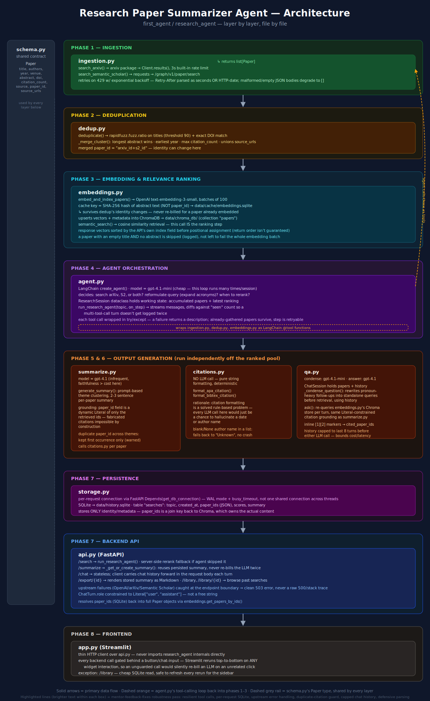

# Research Paper Summarizer Agent

An agent that takes a natural-language research topic, searches arXiv and
Semantic Scholar, deduplicates and ranks results by semantic relevance,
produces a structured literature summary grounded strictly in retrieved
abstracts, generates citations, and answers conversational follow-up
questions — with every claim traceable back to a specific paper.

No Google Scholar (no official API, scraping violates ToS) — only the
arXiv and Semantic Scholar APIs are used.

## Architecture



The diagram above is the detailed, file-by-file view (updated for the
robustness/reliability changes below — brighter highlighted lines within
each box). The condensed version:

```
Topic
  │
  ▼
┌────────────────────┐   ┌──────────────────────┐
│ ingestion.py        │   │ dedup.py              │
│ search_arxiv()       │──▶│ fuzzy title + DOI     │
│ search_semantic_     │   │ match, merge records  │
│ scholar()            │   └───────────┬──────────┘
└────────────────────┘               │
                                       ▼
                          ┌──────────────────────┐
                          │ embeddings.py         │
                          │ batch-embed abstracts │
                          │ (cached), store in    │
                          │ Chroma, cosine search │
                          └───────────┬──────────┘
                                       ▼
                          ┌──────────────────────┐
                          │ agent.py              │
                          │ LangChain tool-calling │
                          │ agent orchestrates the │
                          │ above: which source(s),│
                          │ query reformulation,   │
                          │ when to rerank         │
                          └───────────┬──────────┘
                                       ▼
                    ┌──────────────────┴──────────────────┐
                    ▼                                       ▼
        ┌──────────────────────┐                ┌──────────────────────┐
        │ summarize.py          │                │ qa.py                 │
        │ theme clustering +     │                │ conversational RAG:    │
        │ grounded per-paper     │                │ condense follow-up →   │
        │ summaries + citations  │                │ retrieve → answer with │
        │ (citations.py: APA/    │                │ inline [n] citations   │
        │ BibTeX, no LLM)        │                │                        │
        └──────────────────────┘                └──────────────────────┘
                    │                                       │
                    └──────────────────┬───────────────────┘
                                        ▼
                          ┌──────────────────────┐
                          │ storage.py (SQLite)   │
                          │ per-request conn. via │
                          │ FastAPI Depends + WAL │
                          │ saved searches:       │
                          │ topic, paper_ids,     │
                          │ scores, summary       │
                          └───────────┬──────────┘
                                       ▼
                          ┌──────────────────────┐
                          │ api.py (FastAPI)       │
                          │ /search /summarize     │
                          │ /chat /export /library │
                          │ upstream errors →      │
                          │ clean 503, no raw 500  │
                          └───────────┬──────────┘
                                       ▼
                          ┌──────────────────────┐
                          │ app.py (Streamlit)     │
                          │ topic input, results,  │
                          │ summary, chat, export   │
                          └──────────────────────┘
```

Persistence has two layers with different jobs:
- **ChromaDB** (`data/chroma_db/`) is the source of truth for paper content
  (title, abstract, authors, ...) and their embeddings — it's keyed by
  `paper_id` and shared across every phase.
- **SQLite** (`data/history.sqlite`) only tracks *which* `paper_id`s belong
  to which saved search (topic, timestamp, scores, generated summary). It
  never duplicates paper content — `paper_id` is the join key back to Chroma.

## Setup

Requires Python 3.12+ and [uv](https://docs.astral.sh/uv/getting-started/installation/).

```bash
uv sync
cp .env.example .env
```

`uv sync` creates a `.venv` and installs the exact pinned versions from
`uv.lock`. Run project commands with `uv run <command>`, or activate the
environment directly with `source .venv/bin/activate`.

Edit `.env` and set:
- `OPENAI_API_KEY` — required (embeddings + summarization + chat + agent).
- `SEMANTIC_SCHOLAR_API_KEY` — optional. Semantic Scholar works
  unauthenticated at a low, shared rate limit; a free key
  ([semanticscholar.org/product/api](https://www.semanticscholar.org/product/api))
  raises it. Search functions degrade gracefully (empty result, not a crash)
  if rate-limited.

## Running the app

Two processes, in separate terminals:

```bash
uv run uvicorn research_agent.api:app --reload --reload-exclude "app.py"
uv run streamlit run research_agent/app.py
```

Then open the URL Streamlit prints (typically `http://localhost:8501`).
Interactive API docs are at `http://localhost:8000/docs`.

`--reload-exclude "app.py"` matters: by default `--reload` watches every
file in the project, including `app.py` (the Streamlit frontend, which the
FastAPI backend never imports). Without the exclude, editing the frontend
mid-request restarts the backend and kills whatever request was in flight —
easy to mistake for a hang or timeout.

## Project structure

```
research_agent/
  schema.py       Paper — the normalized record shared by every phase
  ingestion.py     search_arxiv(), search_semantic_scholar()
  dedup.py         cross-source deduplication + merge
  embeddings.py    batched + cached embedding, Chroma storage, cosine retrieval
  agent.py         LangChain tool-calling orchestration agent
  summarize.py     theme clustering + grounded per-paper summaries
  citations.py     APA + BibTeX formatting (deterministic, no LLM)
  qa.py            conversational RAG over retrieved abstracts
  storage.py       SQLite persistence for saved searches
  api.py           FastAPI backend
  app.py           Streamlit frontend
scripts/           runnable CLI demos for each phase (see below)
tests/             deterministic unit tests (128 tests, zero network/LLM
                   calls required — see "Run the tests" below)
data/              gitignored: chroma_db/, cache/, history.sqlite
```

### Try each phase individually

```bash
uv run python scripts/test_ingestion.py "your topic"          # phase 1: raw search
uv run python scripts/test_dedup.py "your topic"               # phase 2: dedup/merge
uv run python scripts/test_ranking.py                          # phase 3: keyword vs. semantic ranking
uv run python scripts/test_agent.py "your topic"                # phase 4: agent + tool-call log
uv run python scripts/test_summarize.py "your topic"            # phase 5: themed summary + citations
uv run python scripts/test_qa.py                                # phase 6: multi-turn grounded chat
uv run python scripts/test_api.py                                # phase 7: full API flow, live
```

### Run the tests

```bash
uv run pytest tests/ -v
```

All 128 tests in `tests/` are fully deterministic and need no network access
and no API keys — every LLM call (OpenAI) and every external API call
(arXiv, Semantic Scholar, Unpaywall/CrossRef, Tavily) is mocked, including
the `OpenAI()` client construction in `api.py`'s FastAPI `lifespan()`, which
otherwise runs unconditionally at `TestClient` startup regardless of which
endpoint a given test hits. Verified directly: `tests/` passes 128/128 with
`.env` entirely absent.

The live smoke tests live separately in `scripts/` (not `tests/`, and not
run by `pytest`) — those intentionally hit real APIs and cost a small amount
of real tokens; see "Try each phase individually" above.

## Key design decisions

- **Dedup cache key is a content hash, not `paper_id`.** A merged record's
  `paper_id` changes (`arxiv_id+s2_id`) when dedup collapses a duplicate —
  keying the embedding cache on the abstract's hash instead means a paper is
  never re-billed just because it was later found to be a duplicate.
- **Relevance ranking *is* retrieval** — cosine similarity over cached
  embeddings, no separate scoring system layered on top.
- **Agent model vs. summarization model:** `gpt-4.1-mini` for the phase-4
  agent's tool-calling loop (many calls per session, cost compounds) vs.
  `gpt-4.1` for summarization/Q&A (infrequent, user-facing, faithfulness
  matters more than marginal cost).
- **Grounding is enforced structurally, not just by prompting.** Every
  citation (`paper_id`) the model can emit is constrained to a dynamic
  `Literal` type built from the exact papers retrieved for that call —
  fabricating a citation is a schema violation, not just discouraged.
  Verified directly (a test asserts an out-of-set `paper_id` is rejected).
- **Theme clustering is prompt-based, not embedding clustering (KMeans
  etc.).** At this project's scale (a handful to ~20 papers per topic), an
  embedding-clustering approach would still need an LLM call afterward just
  to name each cluster — folding grouping into the same call that writes
  the summaries is fewer LLM calls, not more.
- **APA/BibTeX citations are pure deterministic string formatting — no
  LLM.** There's nothing a model would do better here, and every LLM call
  is a chance to hallucinate a citation detail.
- **Follow-up questions are condensed into a standalone query before
  retrieval** (e.g. "what about its limitations?" → "what are RoCoFT's
  limitations?"), costing one small extra LLM call per turn — skipped
  entirely on the first turn, where there's no history to resolve against.
- **Chat history is not persisted server-side.** The client carries it
  forward per-request; only *searches* are saved to SQLite, per the brief.
- **`/summarize` and `/export` reuse a previously generated summary** for a
  given `search_id` instead of re-billing the LLM on repeat calls.
- **Every LLM-backed call in the Streamlit app is gated behind an explicit
  button/chat-input action.** Streamlit reruns the entire script on every
  widget interaction, so an unguarded call would silently re-trigger (and
  re-bill) on unrelated clicks.

## Robustness & reliability pass

A later review pass (branch `mentor-feedback-fixes`) hardened several edge
cases and failure modes that the original phases above didn't cover. No
behavior changed for valid/well-formed input anywhere in this list — every
fix below only changes what happens on an already-broken or edge-case input,
verified by keeping the full test suite green (101 → 128 tests) throughout.

- **Defensive parsing fixes:** a blank/`None` author name inside an
  otherwise normal author list no longer crashes APA/Harvard formatting
  (falls back to `"Unknown"`); a malformed/empty Semantic Scholar response
  body is caught and degrades to `[]` instead of raising;
  `Retry-After` is parsed as either plain seconds or an HTTP-date (both are
  valid per RFC 9110), falling back to the existing backoff default if
  neither parses; a paper with both an empty title and no abstract is
  skipped (logged) rather than failing the whole embedding batch.
- **Embedding order correctness:** OpenAI's embeddings API doesn't guarantee
  response order matches request order — vectors are now sorted by the
  API's own `index` field before being assigned back to their papers,
  instead of trusting list position.
- **Resilient agent tool calls:** each of the four agent tools
  (`search_arxiv_tool`, `search_semantic_scholar_tool`,
  `rerank_by_relevance_tool`, `search_web_tool`) now wraps its body in
  try/except, so one tool's failure (e.g. an OpenAI embedding call erroring
  mid-rerank) returns a description instead of killing the whole agent run
  — already-gathered papers survive, and the failed step is retryable.
- **Per-request SQLite connections:** `storage.py` moved from one SQLite
  connection shared across every request (`check_same_thread=False`) to a
  FastAPI `Depends`-based connection opened and closed per request
  (`get_db_connection`), plus WAL journal mode and a `busy_timeout` — the
  standard pairing for safe concurrent access under FastAPI's
  multi-threaded request handling. Verified with a 20-thread concurrent
  write test.
- **Clean upstream error responses:** `/search`, `/summarize`, `/chat`, and
  `/export` now catch `OpenAIError`/`ArxivError`/`RequestException` at the
  endpoint boundary and return a clean `503 {"error": "... unavailable"}`
  instead of leaking a raw 500 with an internal stack trace — while
  intentional 404s (`HTTPException`) are re-raised untouched, not swallowed
  into a 503.
- **Duplicate-citation guard:** the dynamic-`Literal` grounding in
  `summarize.py` guarantees a cited `paper_id` was actually retrieved, but
  never prevented the *same* `paper_id` from being placed in more than one
  theme — a post-generation check now keeps only its first occurrence
  (logged as a warning).
- **Capped chat history:** `qa.py` now caps chat history to the last 8
  turns (16 messages) before either LLM call it makes per turn (follow-up
  condensing and answer generation), bounding cost/latency growth as a
  conversation lengthens. The cap is prompt-only — `session.history` itself
  stays fully intact for a UI transcript.
- **Zero-API-key test suite:** the `OpenAI()` client construction in
  `api.py`'s `lifespan()` (previously unconditional and unmocked in tests)
  is now mocked in the shared test fixture — `pytest tests/` passes
  128/128 with `.env` entirely absent, not just with real credentials
  configured.

## Known limitations

- Abstracts only — no PDF full-text ingestion (out of scope for v1).
- No auth/multi-user support; chat history lives in the browser session,
  not the database.
- Semantic Scholar's unauthenticated tier rate-limits under repeated use;
  get a free key if you hit this often.
- Author-name parsing for APA/BibTeX (`"First Last"` → `"Last, F."`) is a
  heuristic — it will mis-format multi-word surnames.
- Structural grounding prevents citing a paper that wasn't retrieved, but
  can't fully prevent an LLM from mis-stating a detail *within* a correctly
  cited paper's summary — an inherent limit of free-text generation, not
  specific to this project.
