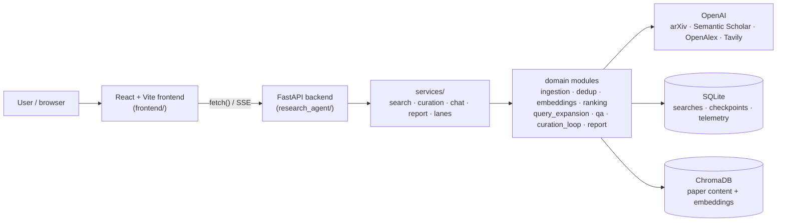

# Research Paper Summarizer Agent

A literature-review assistant. Give it a research topic and it searches
arXiv and Semantic Scholar, deduplicates and semantically ranks the
results, and helps you curate a paper set, generate a grounded
literature-review report, and chat about it — with every citation
traceable to a specific retrieved paper (grounding is enforced by the
schema, not just the prompt). A React frontend is the primary UI; a
FastAPI backend does the work. Single-user, local-first, with an optional
fail-closed auth gate for a protected deployment.

Only the arXiv and Semantic Scholar APIs are used for paper search — no
Google Scholar (no official API; scraping violates its ToS).

## Capabilities

- **Search + candidate pool** — topic search across arXiv and Semantic
  Scholar, cross-source dedup/merge, optional LLM-suggested-title
  widening, and semantic (cosine) ranking over cached embeddings.
- **Interactive curation** — review candidates a batch at a time, pick
  what matters, refine the search mid-flow, browse past turns. Each paper
  shows up to 6 deterministic offline keywords (YAKE-v2, no LLM or
  network call).
- **Research Lanes** *(optional, off by default)* — start a review from
  up to four complementary search "lanes" instead of one topic string,
  with lane-of-origin provenance on every paper. Gated behind
  `RESEARCH_LANES_ENABLED`.
- **Policy C keyword filtering** *(optional, off by default)* — an LLM
  narrowing pass over the displayed batch's keywords, gated behind
  `KEYWORD_FILTER_POLICY_C_ENABLED`. YAKE-v2 is the normal behavior.
- **Grounded report** — a synthesized literature-review report with
  inline `[n]` citations, a global references list, reader-depth
  templates, an optional single-pass refinement loop, version history,
  and Markdown / PDF / DOCX export.
- **Paper-grounded chat** — ask questions about the curated set; the
  answer can only cite papers actually in scope. Optional live web
  context, with a relevance gate, and the option to fold an answer's
  approved web sources into the report.
- **Real-time progress** — curation chat and report generation stream
  phase-level progress over Server-Sent Events (never token-by-token);
  every synchronous endpoint remains available and unchanged.
- **Usage protection** — configurable per-session / global paid-action
  budgets, a one-in-flight concurrency lease, and request-size caps.
  Rejections return a stable reason code and a safe message. A separate
  telemetry DB records operational metadata only — never prompt, chat,
  or report content.

## How it works

**Search → dedup → embed → rank.** `ingestion.py` queries arXiv and
Semantic Scholar; `dedup.py` merges duplicates (fuzzy title + DOI);
`embeddings.py` batch-embeds abstracts (content-hash cached) into Chroma;
retrieval is cosine similarity over those embeddings. Optionally,
`query_expansion.py` widens the pool with LLM-suggested related titles.

**Curation loop.** `curation_loop.py` is a LangGraph `StateGraph` used
purely for checkpointing and `interrupt()`/resume — a batch is presented,
the HTTP request returns, and a later request resumes the graph with the
user's picks. Curation state (`PaperPoolSession`) is persisted per turn.

**Report + chat.** `report.py` generates and regenerates the report;
`curation_chat.py` answers questions grounded in the curated papers,
constrained so a cited `paper_id` must be one that was actually
retrieved. Chat history is preserved in full but bounded for the model
via a persisted summary of older turns.

**Persistence.** ChromaDB (`data/chroma_db/`) is the source of truth for
paper content and embeddings, keyed by `paper_id` and shared across every
flow. SQLite holds only the join data — which `paper_id`s belong to which
saved search / curation session, plus checkpoints and operational
telemetry — never a second copy of paper content.

The original one-shot pipeline (`/search` → `/summarize` → `/chat` →
`/export`) is still available directly via the API; there is no dedicated
frontend for it anymore.

## Architecture


```mermaid
flowchart LR
    U["User / browser"] --> FE["React + Vite frontend<br/>(frontend/)"]
    FE -->|"fetch() / SSE"| API["FastAPI backend<br/>(research_agent/)"]
    API --> SVC["services/<br/>search · curation · chat · report · lanes"]
    SVC --> DOM["domain modules<br/>ingestion · dedup · embeddings · ranking<br/>query_expansion · qa · curation_loop · report"]
    DOM --> EXT["OpenAI<br/>arXiv · Semantic Scholar · OpenAlex · Tavily"]
    DOM --> DB[("SQLite<br/>searches · checkpoints · telemetry")]
    DOM --> CH[("ChromaDB<br/>paper content + embeddings")]
```

Full current architecture (layered structure, request flow, every
module): [`docs/architecture.md`](docs/architecture.md).

## Quick start

Requires **Python 3.12+** and [uv](https://docs.astral.sh/uv/getting-started/installation/),
plus **Node 20+** for the frontend.

```bash
uv sync                 # creates .venv, installs pinned deps from uv.lock
cp .env.example .env     # then set OPENAI_API_KEY (see Configuration)
```

Run the two processes in separate terminals:

```bash
# backend
uv run uvicorn research_agent.api:app --reload --reload-exclude "frontend/*"

# frontend
cd frontend && npm install && npm run dev
```

Open `http://localhost:5173`. Interactive API docs are at
`http://localhost:8000/docs`.

`--reload-exclude "frontend/*"` matters: without it, `--reload` also
watches the entire `frontend/` tree and restarts the backend (killing the
in-flight request) whenever a frontend file is saved.

Each pipeline phase also has a standalone live demo under `scripts/`
(`scripts/test_ingestion.py "topic"`, `scripts/test_agent.py "topic"`,
…) — these hit real APIs and cost real tokens.

## Configuration

All via `.env` (copy from [`.env.example`](.env.example), which documents
every variable). The essentials:

| Variable | Required? | Purpose |
|---|---|---|
| `OPENAI_API_KEY` | **yes** | embeddings, summarization, chat, agent |
| `SEMANTIC_SCHOLAR_API_KEY` | optional | raises the Semantic Scholar rate limit (search degrades gracefully without it) |
| `TAVILY_API_KEY` | optional | enables live web context in chat |
| `UNPAYWALL_EMAIL` / `OPENALEX_MAILTO` | optional | polite-pool contact for abstract enrichment / OpenAlex fallback |
| `LANGFUSE_PUBLIC_KEY` / `LANGFUSE_SECRET_KEY` / `LANGFUSE_BASE_URL` | optional | Langfuse tracing (inert no-op when unset) |
| `KEYWORD_FILTER_POLICY_C_ENABLED` | optional, default **false** | opt-in LLM keyword-narrowing pass |
| `RESEARCH_LANES_ENABLED` | optional, default **false** | opt-in multi-query "research lanes" curation |
| `APP_ENV` / `AUTH_ENABLED` / `AUTH_USERNAME` / `AUTH_PASSWORD` | optional (required for a protected deployment) | fail-closed HTTP Basic Auth — see Deployment |
| `FRONTEND_ORIGIN` | optional | the one browser origin allowed for credentialed CORS — see Deployment |

Both feature flags and the auth gate default to off; local development
with only `OPENAI_API_KEY` set is the normal case.

## Running tests

```bash
uv run pytest                    # backend — fully deterministic
cd frontend && npm test          # frontend — Vitest
cd frontend && npm run build     # frontend — type-check + production build
cd frontend && npm run lint      # frontend — oxlint
cd frontend && npm run e2e       # frontend — Playwright (needs live servers)
```

Every backend test is deterministic and needs **no network access and no
API keys** — every OpenAI call and every external API call (arXiv,
Semantic Scholar, Unpaywall/CrossRef, Tavily) is mocked, including the
`OpenAI()` client constructed at FastAPI startup, and Langfuse tracing is
disabled for the whole suite. `uv run pytest` passes with `.env` entirely
absent.

The real-pipeline evaluation harnesses live in `scripts/` (not run by
`pytest`) and cost real tokens — see [`docs/evaluation.md`](docs/evaluation.md).

## Single-user deployment

A **protected, same-origin, single-process** production package exists and
has been validated with a local Docker build + smoke test and a real
backup/restore drill (zero paid calls in either). It is **not** a cloud
deployment.

- **Fail-closed HTTP Basic Auth** (`research_agent/auth_middleware.py`),
  the outermost middleware — only `GET /health` is public; every other
  route requires credentials when the gate is enabled. `APP_ENV=production`
  **requires** `AUTH_ENABLED=true` with a validated username and a
  ≥16-character password, checked once at startup — there is no
  production auth-disable override.
- **Credentialed cross-origin support** — `FRONTEND_ORIGIN` defines the
  one trusted browser origin (validated: scheme + host only, no `*`, no
  path; a `localhost` value is refused in production). Same-origin
  production needs nothing set. The auth 401 carries the matching
  `Access-Control-Allow-Origin` / `Access-Control-Allow-Credentials`
  headers so a permitted frontend gets a readable response. Full contract:
  [`docs/deployment.md`](docs/deployment.md) §1 / §1a.
- **Same-origin packaging** — FastAPI serves the built React frontend from
  its own origin; a non-root, one-uvicorn-worker Docker image with pinned
  build tooling.
- **Backup / restore** — `scripts/data_backup.py create|verify|restore`
  for `data/`, requiring the app stopped and only ever restoring into a
  brand-new destination outside `data/`.

**Deferred, by design:** cloud-platform selection, HTTPS termination,
managed secrets and persistent volumes, automated/off-site backups,
monitoring, OAuth / multi-user support, PostgreSQL (or any DB other than
SQLite), and horizontal scaling — SQLite and embedded Chroma cap this at a
single worker / single instance. See
[`docs/deployment.md`](docs/deployment.md) and
[`specs/production-readiness-roadmap.md`](specs/production-readiness-roadmap.md).

## Documentation

| Topic | Document |
|---|---|
| Full architecture, request flow, per-feature design | [`docs/architecture.md`](docs/architecture.md) |
| Evaluation workflow, retrieval/ranking findings, RAGAS, report-quality, keyword-quality (K5) | [`docs/evaluation.md`](docs/evaluation.md) |
| Deployment, auth, credentialed CORS, backup/restore | [`docs/deployment.md`](docs/deployment.md) |
| Research Lanes — design, API contracts, provenance model | [`docs/architecture.md`](docs/architecture.md) ("Research Lanes" section) |
| Milestone history | [`docs/project-history.md`](docs/project-history.md) |
| Backend standardization plan | [`specs/migration-plan.md`](specs/migration-plan.md) |
| Production-readiness plan (auth / Postgres / multi-user, design-only) | [`specs/production-readiness-roadmap.md`](specs/production-readiness-roadmap.md) |
| Known bugs, feature ideas, technical debt | [`specs/backend-backlog.md`](specs/backend-backlog.md) |
| Frontend structure and commands | [`frontend/README.md`](frontend/README.md) |
| Evaluation datasets / result-artifact policy | [`eval_data/README.md`](eval_data/README.md) · [`eval_results/README.md`](eval_results/README.md) |
| Original hand-drawn architecture diagram (historical) | [`docs/archive/README.md`](docs/archive/README.md) |

## Known limitations

- **Abstracts only** — no PDF full-text ingestion.
- **Single-user only** — a protected deployment is possible, but there is
  no multi-user / OAuth support; chat history lives in the browser
  session, not the database.
- **Grounding** is structural — a model cannot cite a paper that wasn't
  retrieved — but cannot fully prevent it from mis-stating a detail
  *within* a correctly cited paper. Inherent to free-text generation.
- **Author-name parsing** for APA/BibTeX is heuristic and mis-formats
  multi-word surnames.
- **Semantic Scholar's** unauthenticated tier rate-limits under repeated
  use; add a free key if you hit it often.
- **Policy C keyword filtering** was validated on small (8–10 paper)
  product-local samples with AI-assisted human labels — no external
  benchmark, no statistical-significance or universal-superiority claim.
  It stays off by default; YAKE-v2 remains the default extractor.
- **Research Lanes** has no mid-curation lane editing, no per-lane refill,
  no lane-aware chat/report synthesis, no coverage guarantee, and no
  statistical evaluation of multi-lane vs. single-query retrieval. Off by
  default.
- **Curation chat's web-relevance threshold** is a starting value, not
  empirically calibrated.
