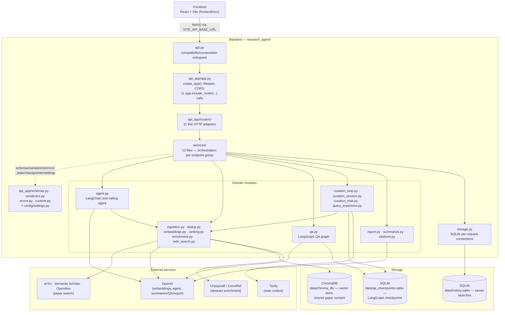

# Architecture

This document describes two things: the architecture as it actually exists
today, and the target layered architecture this project is migrating toward
incrementally (see `specs/migration-plan.md` for the phased plan). Nothing in
this document changes behavior — it's a map, not a refactor.

`research_agent_architecture.svg` (now archived at `docs/archive/
research_agent_architecture.svg` — see that directory's `README.md`)
described the original single-pipeline research agent (search → dedup →
rank → summarize/chat). That description is still accurate for that part
of the system, but predates the curation/report/chat system, the React
UI, and the entire backend standardization below — this document,
including the Mermaid diagram right below, is the current, accurate
source of truth for the whole app as it stands today.

## Current architecture

The diagram below reflects the app as of the `standardized-single-user-
project` tag — every layer named is real and current, not aspirational
(see "Target architecture" further down for what's still ahead):



`api.py` is the compatibility/composition entrypoint —
`uvicorn research_agent.api:app` still boots the exact same app object it
always has — but almost everything it used to hold directly now lives
under `api_app/`/`services/`/`config/`, re-exported back into `api.py`
for anything still reaching it via `research_agent.api.<name>` or
`patch.object(api, "<name>", ...)`. See the router inventory, the
`api_app/` module table, and the `services/` list further down for the
full file-by-file detail behind this diagram.

### Phase 2 snapshot (2026-07-29) — historical, not current

**Kept below for history — this describes the state right after Phase 2
only, before Phases 3–10/14 moved schemas, serializers, the service
layer, runtime state, and app composition out of `api.py`.** See the
Mermaid diagram above for the current architecture; this ASCII sketch
and its surrounding description are a preserved snapshot, not a live
reference.

```
frontend/ (React + Vite)
  │  fetch()
  ▼
research_agent/api.py  (thin compatibility entrypoint — imports, _state,
  │                      every Pydantic model, shared helpers, and 12
  │                      app.include_router(...) calls; no route bodies)
  ▼
research_agent/api_app/routers/  (every actual route handler now lives here
  │                                — see the full inventory below)
  ├── original one-shot pipeline
  │     /search, /summarize, /chat, /export, /library, /health
  │
  └── curation pipeline (the interactive review/report/chat system)
        /curation/start, /curation/{id}/picks, /curation/reviews,
        /curation/{id} (GET), /curation/{id} (DELETE),
        /curation/{id}/select-from-history, /curation/{id}/reopen,
        /curation/{id}/report, /curation/{id}/report/regenerate,
        /curation/{id}/chat
  │
  ▼
domain modules (research_agent/, flat, no services/agents/graphs/rag/sources split yet)
  agent.py            LangChain tool-calling agent (genuinely agentic — the
                       model itself decides arXiv vs. Semantic Scholar vs.
                       both, query reformulation, when to rerank)
  qa.py                LangGraph StateGraph: classify → condense → retrieve →
                       generate, fixed routing over plain state checks. Powers
                       BOTH /chat and (via curation_chat.py) the curation
                       chat's grounded answers.
  curation_loop.py      LangGraph StateGraph: the interactive present → pick →
                       resume interrupt loop (checkpointed, survives a page
                       refresh or server restart mid-turn)
  curation_session.py   Minimal LangGraph StateGraph (one no-op node) whose
                       only job is giving the checkpointer something to
                       persist PaperPoolSession state around; also owns
                       select_paper_from_history/reopen_curation_session/
                       delete_curation_session/list_curation_sessions
  curation_chat.py      Plain functions: offer-and-decide web-search/
                       report-update escalation on top of qa.py's ask()
  query_expansion.py    PaperPoolSession (the curation session's own state),
                       candidate-pool building/ranking/refill, canonicalize_
                       topic, suggest_related_titles
  report.py             Literature-review report generation/regeneration
  ingestion.py           search_arxiv(), search_semantic_scholar()
  dedup.py               cross-source deduplication + merge
  embeddings.py          batched + cached embedding, Chroma storage, retrieval
  ranking.py             alternative FINAL-ranking strategies for evaluation
                       only (BM25, RRF, citation-partitioned rerank) — never
                       used by the live app's default path
  enrichment.py          abstract backfill for papers missing one
  web_search.py          Tavily web search wrapper
  citations.py           APA + BibTeX formatting (deterministic, no LLM)
  summarize.py           theme clustering + grounded per-paper summaries
                       (original one-shot pipeline only)
  storage.py             SQLite persistence for the original one-shot
                       pipeline's saved searches (data/history.sqlite)
  tracing.py             shared Langfuse helpers
  schema.py              Paper / WebArticle — the normalized records shared
                       by every phase
  │
  ▼
storage
  data/chroma_db/         vector store — source of truth for paper content +
                         embeddings, keyed by paper_id, shared everywhere
  data/history.sqlite     original pipeline's saved-search records only
  data/qa_checkpoints.sqlite  LangGraph checkpointer DB — shared by qa.py's
                         (currently inactive) conversation persistence AND
                         every curation session (namespaced by thread_id
                         prefix "curation-session:")
  data/cache/             embedding cache
```

### Phase 2: API split — router inventory

Every router lives in `research_agent/api_app/routers/`, one file per
logical endpoint group (finer-grained than the six-file sketch originally
proposed in "Target architecture" below — grouping followed test-patch
boundaries and shared-helper usage rather than a fixed count decided up
front):

| Router file | Endpoint(s) |
|---|---|
| `health.py` | `GET /health` |
| `library.py` | `GET /library`, `GET /library/{search_id}` |
| `export.py` | `GET /export/{search_id}` |
| `summarize.py` | `POST /summarize` |
| `chat.py` | `POST /chat` (original one-shot pipeline) |
| `search.py` | `POST /search` (both the agent path and the `use_query_expansion=True` path) |
| `curation_core.py` | `POST /curation/start`, `POST /curation/{id}/picks` |
| `curation_sessions.py` | `GET /curation/reviews`, `GET /curation/{id}`, `DELETE /curation/{id}` |
| `curation_history.py` | `POST /curation/{id}/select-from-history`, `POST /curation/{id}/reopen` |
| `curation_reports.py` | `POST /curation/{id}/report`, `POST /curation/{id}/report/regenerate` |
| `curation_chat.py` | `POST /curation/{id}/chat` |

### Why `research_agent/api_app/`, not `research_agent/api/`

The original Phase 2 design called for converting `api.py` into a package —
`research_agent/api/app.py` plus an `__init__.py` re-exporting `app` and
every test-patched name. A review caught a real, verified bug in that plan
before any code moved: `unittest.mock.patch.object(api, "name")` mutates
whichever module a function's `__globals__` actually points to — the module
it's *physically defined in* — not whatever re-exports that name elsewhere.
A wildcard re-export (`from .app import *`) only copies names into the
package's own dict once, at import time; it doesn't alias the two dicts.
Patching `research_agent.api.chat_turn` afterward would only touch the
package's copy, while a handler physically relocated into `app.py` would
still resolve its own bare-name call against `app.py`'s dict, unaffected —
silently running the real function instead of the mock in what's supposed
to be a fully deterministic, offline test suite. Confirmed directly with an
isolated scratch reproduction before accepting the fix, not assumed.

The fix: never rename or relocate `api.py` at all. `research_agent/api_app/`
is an entirely separate, temporary package name specifically so it can
exist *alongside* the still-live `api.py` with zero import collision at
any point, ever. Every moved handler that needs a dependency tests patch
(`build_candidate_pool`, `chat_turn`, `run_research_agent`, `ask`, etc.) does
`import research_agent.api as api` and calls `api.<name>(...)` — a fresh
attribute lookup against the *original, still-patchable* module, at call
time, every call — never a `from research_agent.<module> import <name>`
binding, which would capture a reference immune to patching. Confirmed
empirically before this became policy, not assumed: a three-way scratch
test showed a relocated handler calling `api.name(...)` still sees the
patch, while one importing `name` directly does not.

### Transition debt this leaves for Phase 3

Phase 2 deliberately optimized for the smallest possible reviewable diff
per route move, not for architectural purity — the following is real,
known debt, not an oversight:

1. **Every router still calls back into `research_agent.api` as `api.<name>`
   for its shared dependencies.** This was the whole point during Phase 2
   (see above), but it means routers aren't actually decoupled from
   `api.py` yet — they're decoupled in *location* only.
2. **Every request/response Pydantic model still lives in `api.py`.** None
   were moved to a `schemas/` module — routers reference them as
   `api.SearchResponse`, `api.CurationStateResponse`, etc.
3. **Shared helpers still live in `api.py`.** `_upstream_error_guard`,
   `_state`, `_curation_config`, `_turn_result_to_response`,
   `_paper_to_out`/`_web_article_to_out`/`_paper_out_from_batch_entry`/
   `_report_to_out`/`_turn_history_out` — all of it, still in one file.
4. **Phase 3's job is specifically to resolve 1–3**: move orchestration
   logic into `services/*.py`, and move the schemas/helpers above into
   their own stable modules that routers import directly — at which point
   the `api.<name>` indirection this phase relied on stops being needed,
   since the underlying functions will have real, independent homes
   patchable in their own right, and `api.py` can shrink to just app
   construction and route registration.

### Phase 3 (service layer) — progress so far

Phase 3 is in progress, moving one route group's orchestration at a time
into `research_agent/services/`. Extracted so far:

| Service file | Function(s) | Backs |
|---|---|---|
| `library_service.py` | `list_library_items`, `get_library_item` | `GET /library`, `GET /library/{search_id}` |
| `summary_service.py` | `summarize_search`, `export_search_markdown` | `POST /summarize`, `GET /export/{search_id}` |
| `chat_service.py` | `answer_search_chat` | `POST /chat` (original one-shot pipeline only — **not** curation chat) |
| `search_service.py` | `run_search` | `POST /search` (both the agent path and `use_query_expansion=True`) |

Not yet extracted: any curation route (`curation_core.py`,
`curation_sessions.py`, `curation_history.py`, `curation_reports.py`,
`curation_chat.py` all still hold their orchestration inline).

Current shape of the stack, mid-Phase-3:

```
api_app/routers/*.py   thin route adapters: get dependencies, call one
                        service function inside api._upstream_error_guard,
                        translate a None/sentinel result into the existing
                        HTTPException where applicable
        │
        ▼
services/*.py           orchestration moved out of routers; still reaches
                        back into api.py via `import research_agent.api as
                        api` for every schema, shared helper, and any name
                        tests patch — same `api.<name>` convention Phase 2
                        established for routers, now used by services too
        │
        ▼
api.py                  still holds every Pydantic model, `_state`, and
                        every shared helper (_upstream_error_guard,
                        _get_or_create_summary, _render_markdown,
                        _paper_to_out family, curation formatting/config
                        helpers) — unchanged since Phase 2
```

Every extracted service function follows the same "return `None` (or, for
`search_service.py`, raise the existing `HTTPException` directly) on a
not-found/empty condition, let the router layer handle the HTTP status"
convention established in `library_service.py`. Three of the four
extractions so far needed one small, explicitly-flagged signature
extension beyond the shorthand originally proposed, in each case because
the current behavior genuinely depends on an extra piece of request state
that a 1- or 2-argument signature would have dropped: `summarize_search`/
`export_search_markdown` take a `style` parameter (citation style changes
the output), `answer_search_chat` takes `history` (prior turns feed the
answer), and `run_search` takes `db` (needed to persist the search and
obtain `search_id`/`created_at`).

### Transition debt still remaining (updated for Phase 3 progress)

1. **Routers and services both still reach into `research_agent.api` as
   `api.<name>`** for every schema, shared helper, and patch-target name —
   this was Phase 2's compatibility mechanism for routers, and Phase 3's
   newly-extracted services follow the identical convention rather than
   introducing a second one. Nothing is decoupled from `api.py` in
   practice yet, only in file location.
2. **`api.py` still owns every request/response Pydantic model** — none
   have moved to a `schemas/` module.
3. **`api.py` still owns shared helpers**: `_upstream_error_guard`,
   `_state`, `_curation_config`, `_turn_result_to_response`,
   `_get_or_create_summary`/`_get_or_create_web_summary`,
   `_render_markdown`, the `_paper_to_out`/`_web_article_to_out`/
   `_paper_out_from_batch_entry`/`_report_to_out`/`_turn_history_out`
   family — all of it, unchanged since Phase 2.
4. **Curation routes have no service layer yet** — `curation_core.py`,
   `curation_sessions.py`, `curation_history.py`, `curation_reports.py`,
   and `curation_chat.py` all still orchestrate inline. This is
   deliberately deferred (see "Next planned area" below) since curation
   touches significantly more shared state (checkpointer dependency
   overrides, report generation, history/reopen flows) than the four
   simpler extractions done so far.
5. **`search_service.py` raises `HTTPException` directly**, rather than
   returning a `None`/sentinel value for the router to translate — noted
   as acceptable temporary debt for this transitional phase, not the
   final ideal layering (a service module raising an HTTP-layer exception
   is exactly the coupling Phase 3 is meant to unwind elsewhere). This
   was safe to leave as-is here because `_upstream_error_guard` already
   re-raises `HTTPException` untouched, so behavior is unaffected; it's
   flagged for cleanup once the curation extraction settles the pattern
   for services with multiple distinct not-found/error branches.

### Validation recorded across Phase 3 so far

```
Step 1 (library_service)  commit ee28449  uv run pytest -q → 342 passed
Step 2 (summary_service)  commit 398022f  uv run pytest -q → 342 passed
Step 3 (chat_service)     commit d95e01d  uv run pytest -q → 342 passed
Step 4 (search_service)   commit c7bc8d3  uv run pytest -q → 342 passed
```

Pass count has stayed flat at 342 across every step — expected, since
Phase 3 (unlike parts of Phase 2) hasn't needed to close any new
coverage gaps so far, only relocate existing orchestration.

### Next planned area: curation service extraction

Curation needs its own mini-plan before extraction starts, rather than
following the same one-step-per-route pattern used above, because it
touches several things the four extractions so far didn't:
`get_curation_checkpointer` (an `app.dependency_overrides`-keyed
dependency, not a `patch.object`-based name — a different risk profile),
report generation/regeneration, the history/reopen flows, and curation
chat's own escalation logic on top of `qa.py`. This will be scoped as a
separate, explicit go-ahead, not assumed as an automatic continuation of
Phase 3 Steps 1–4.

**Update: curation service extraction is done.** All five curation route
groups now have a service module (`curation_session_service.py`,
`curation_core_service.py`, `curation_history_service.py`,
`curation_report_service.py`, `curation_chat_service.py`), completing
Phase 3's route-group extraction for every endpoint in the API. See
`specs/migration-plan.md`'s Phase 3 section for the full commit-by-commit
record. `get_curation_checkpointer` was deliberately left in `api.py`,
untouched — every curation router still declares
`Depends(api.get_curation_checkpointer)` itself, so the
`app.dependency_overrides`-keyed identity tests rely on stayed intact.

### Phase 4 (schemas + serializers) — done

Phase 4 moved the two remaining category of things Phase 3 identified as
debt (see "Transition debt still remaining" above) that hadn't yet been
given a real home: request/response Pydantic models, and pure output/
serialization/rendering helpers.

| New module | Owns |
|---|---|
| `research_agent/api_app/schemas.py` | All 28 request/response Pydantic models (`SearchRequest` … `CurationSelectFromHistoryResponse`) |
| `research_agent/api_app/serializers.py` | Every pure output/serialization/rendering helper: `_paper_to_out`, `_web_article_to_out`, `_web_articles_from_saved`, `_summary_to_json`, `_web_summary_to_json`, `_paper_out_from_batch_entry`, `_turn_history_out`, `_report_to_out`, `_turn_result_to_response`, `_render_markdown` (plus `_STYLE_LABELS`) |

`research_agent/api.py` shrank from 787 to 369 lines as a direct result.
Neither new module imports `api.py` — `schemas.py` depends only on
pydantic/typing/`citations.CitationStyle`; `serializers.py` depends on
`schemas.py` plus `research_agent.schema`/`citations` directly. No
circular imports were introduced.

**`api.py` re-exports every moved name** at its top (`from
research_agent.api_app.schemas import ...` / `from
research_agent.api_app.serializers import ...`), so
`research_agent.api.<Name>` and `patch.object(api, "<name>", ...)` keep
resolving exactly as before — the patch mechanism mutates `api.py`'s own
module dict regardless of whether a name was originally defined there or
imported in, so this required no test changes.

**Current architecture after Phase 4:**

```
api_app/routers/*.py     thin route adapters — unchanged since Phase 3
        │
        ▼
services/*.py            orchestration for search, summary/export,
                        library, regular chat, and all five curation
                        groups — unchanged since Phase 3
        │
        ▼
api_app/schemas.py        every request/response Pydantic model — NEW
api_app/serializers.py    output conversion / markdown formatting — NEW
        │
        ▼
api.py                    compatibility/composition entrypoint: app +
                        lifespan + CORS + include_router wiring, _state,
                        get_curation_checkpointer, _upstream_error_guard,
                        _curation_config, _get_or_create_summary/
                        _get_or_create_web_summary, _server_side_rerank,
                        _filtered_candidate_count, _reselect_style, and
                        re-exports of everything in schemas.py/
                        serializers.py
```

**Why routers/services still call `api.<name>` rather than importing
schemas.py/serializers.py directly** (a deliberate choice, not an
oversight): every already-migrated router and service (~15 files) was
left untouched in this same commit, for three reasons — (1) it keeps
`patch.object(api, "<name>", ...)` working for every existing test
without auditing each call site's patch sensitivity individually, (2) it
keeps Phase 4's diff a strict, low-risk relocation with zero call-site
changes elsewhere, and (3) it leaves a safe, well-scoped future cleanup:
switching a call site to import directly from `schemas.py`/`serializers.py`
is safe wherever that name is never patched in a test, and unsafe
wherever it still is — that audit is future work, not assumed here.

**Remaining debt after Phase 4:**

1. `api.py` still owns app/lifespan/CORS/router composition — no `app.py`/
   app-factory module exists yet.
2. `api.py` still owns `_state`.
3. `api.py` still owns the dependency provider `get_curation_checkpointer`
   — not moved, to preserve `app.dependency_overrides` key identity.
4. `api.py` still owns `_upstream_error_guard`, `_curation_config`,
   `_get_or_create_summary`, `_get_or_create_web_summary`,
   `_server_side_rerank`, `_filtered_candidate_count`, `_reselect_style`
   — none of these are pure output serializers (they read `_state` or
   call DB/LLM functions), so Phase 4 deliberately left them in place.
5. `search_service.py` and all four of the curation-core/history/report/
   chat services still raise `HTTPException` directly rather than
   returning a uniform sentinel for the router to translate — flagged
   since Phase 3, still true.
6. `research_agent/api_app/` is still the interim package name chosen
   specifically to avoid the `api.py`/`api/` import collision (see "Why
   `research_agent/api_app/`, not `research_agent/api/`" above) — renaming
   it to `api/` is deferred until `api.py`'s compatibility constraints are
   deliberately retired, not before.

### Phase 5 (direct schema/serializer imports) — done

Phase 5 executed the "Low risk" option from Phase 4's table above: every
router and service touched by Phases 2–3 (9 routers + 9 services) now
imports Pydantic models from `schemas.py` and pure helpers from
`serializers.py` directly, instead of via `api.<name>`. Two files
(`routers/library.py`, `services/curation_session_service.py`) had no
remaining patch-target/state/guard references after the swap, so their
`import research_agent.api as api` was removed entirely; every other
touched file keeps that import for whatever's still only reachable that
way (patch targets, `_state`, `get_curation_checkpointer`).

One reference was deliberately left as `api.<name>` outside the allowed
schema/serializer lists: `api._merge_web_articles` in `search_service.py`
— it's a domain function from `agent.py`, not a schema or a serializer,
and wasn't in Phase 5's scope, so it was left rather than silently moved.
(Phase 6, below, later gave it a real home in `search_helpers.py`.)

`api.py`'s compatibility re-exports were untouched by this phase — no
schema/serializer moved location, only who imports them changed.
Validation: `test_api.py` + `test_curation_api.py` 77 passed; full
backend suite 342 passed; frontend `npm test` 98 passed; `npm run build`
clean.

### Phase 6 (behavioral helpers extraction) — done

Phase 6 moved the remaining non-endpoint behavioral helpers out of
`api.py` into four focused modules, executing the "Medium" option from
Phase 4's table (dependency providers/error-guard helpers) plus the
summary-cache/search/curation helper groups that emerged from auditing
what was left:

| New module | Owns |
|---|---|
| `research_agent/api_app/errors.py` | `_upstream_error_guard`, `_UPSTREAM_ERRORS` — pure, no `api.py` dependency |
| `research_agent/services/summary_cache.py` | `_get_or_create_summary`, `_get_or_create_web_summary`, `_reselect_style` |
| `research_agent/services/search_helpers.py` | `_server_side_rerank`, `_filtered_candidate_count`, and `_merge_web_articles` (re-exported here from `agent.py` instead of imported directly into `api.py` — never patched either way, so patchability is unaffected by the move) |
| `research_agent/services/curation_helpers.py` | `_curation_config` |

`research_agent/api.py` shrank from 369 to 232 lines. `get_curation_checkpointer`
and `_state` were **not** moved — both stay in `api.py`, unchanged, exactly
as scoped. Every new module reaches `api.<name>`/`api._state` via `import
research_agent.api as api`, accessed only inside function bodies (never at
import time) — the same safe circular-import pattern `api_app/routers/*.py`
has relied on since Phase 2: Python only needs the (possibly
still-loading) `research_agent.api` module object to exist in `sys.modules`
at the new module's import time, and none of them touch `api.<name>`
until a function is actually called, long after `api.py` has finished
loading.

`api.py` re-exports every moved name, so `research_agent.api.<name>` and
`patch.object(api, "<name>", ...)` keep working unchanged.
`_upstream_error_guard` is never patched in any test, so the 8 routers
that use it (`chat`, `curation_chat`, `curation_core`, `curation_history`,
`curation_reports`, `export`, `search`, `summarize`) now import it
directly from `errors.py`. The other three new modules' helpers were
**not** swept into direct imports at their call sites — `search_service.py`,
`summary_service.py`, and the curation services still reach
`_server_side_rerank`/`_filtered_candidate_count`/`_get_or_create_summary`/
`_get_or_create_web_summary`/`_curation_config` via `api.<name>`, relying
on the re-export. Phase 6 only asked for a direct-import sweep on
`_upstream_error_guard`; a broader sweep for the other three modules is
listed as Phase 7 option 1 below.

**Current architecture after Phase 6:**

```
api_app/routers/*.py     thin HTTP adapters — import schemas/serializers/
                        _upstream_error_guard directly; import api only
                        for patch targets, _state, get_curation_checkpointer
        │
        ▼
services/*.py            business orchestration + helper logic — search,
                        summary/export, library, regular chat, all five
                        curation groups, plus summary_cache/search_helpers/
                        curation_helpers
        │
        ▼
api_app/schemas.py        API data contracts (28 Pydantic models)
api_app/serializers.py    pure output conversion / markdown formatting
api_app/errors.py         upstream error normalization
        │
        ▼
api.py                    composition + compatibility only: app/lifespan/
                        CORS, _state, get_curation_checkpointer, 12
                        app.include_router(...) calls, and re-exports of
                        everything in schemas.py/serializers.py/errors.py/
                        summary_cache.py/search_helpers.py/curation_helpers.py
```

**Remaining debt after Phase 6:**

1. `api.py` still owns `_state` and `get_curation_checkpointer` — neither
   moved, by design (dependency-override key identity for the latter).
2. `api.py` still owns FastAPI app construction/lifespan/CORS/router
   composition — no app-factory module exists yet.
3. `search_service.py` and the curation core/history/report/chat services
   still raise `HTTPException` directly rather than returning a uniform
   sentinel for the router to translate — flagged since Phase 3, still
   true.
4. Some service call sites still use `api.<helper>` re-exports for
   compatibility even though those helpers now live in `summary_cache.py`/
   `search_helpers.py`/`curation_helpers.py` — a deliberately narrower
   sweep than Phase 5 did for schemas/serializers (see above).
5. `research_agent/api_app/` remains the interim package name until
   `api.py`'s compatibility constraints are intentionally retired.

### Phase 7 (direct helper imports) — done

Phase 7 executed the "Low/medium" option from Phase 6's table above:
every remaining safe `api.<helper>` reference (for helpers Phase 6 moved
out of `api.py`) was replaced with a direct import from its new module.

| File | Now imports directly | Still keeps `import research_agent.api as api` for |
|---|---|---|
| `search_service.py` | `_filtered_candidate_count`, `_server_side_rerank`, `_merge_web_articles` (from `search_helpers.py`) | `expanded_search`, `run_research_agent`, `search_web` (patch targets) |
| `summary_service.py` | `_get_or_create_summary`, `_get_or_create_web_summary` (from `summary_cache.py`) | nothing — the `api` import was removed entirely |
| `curation_core_service.py` | `_curation_config` (from `curation_helpers.py`) | `_state`, `build_candidate_pool`, `rank_full_pool`, `canonicalize_topic` (patch targets/state) |
| `curation_history_service.py` | `_curation_config` (from `curation_helpers.py`) | nothing — the `api` import was removed entirely |

`_upstream_error_guard` needed no changes in this phase — every router
already imported it directly from `api_app/errors.py` as of Phase 6.

**`api.<name>` references still remaining, and why** (this is now the
complete list — nothing else is left to sweep):
1. **Patch targets**, reached via `import research_agent.api as api` in
   whichever service still calls them: `run_research_agent`,
   `expanded_search`, `search_web`, `ask`, `chat_turn`,
   `get_papers_by_ids`, `build_candidate_pool`, `rank_full_pool`,
   `canonicalize_topic`, `generate_report_for_session`,
   `regenerate_report_with_new_sources`, `generate_summary`,
   `generate_web_summary`, `semantic_search`, `embed_and_index_papers`,
   `OpenAI`, `init_db`. These stay `api.<name>` permanently (or until the
   underlying function itself moves) — importing any of them directly
   from its source module would capture a reference immune to
   `patch.object(api, "<name>", ...)`.
2. **`api._state`** — the one piece of shared mutable state every request
   handler reads from; still owned by `api.py`.
3. **`api.get_curation_checkpointer`** — the dependency-override identity
   anchor; every curation router still declares
   `Depends(api.get_curation_checkpointer)` itself, unchanged.

**Current architecture after Phase 7:**

```
api_app/routers/*.py     thin HTTP adapters — import schemas/serializers/
                        _upstream_error_guard directly; import api only
                        for patch targets, _state, get_curation_checkpointer
        │
        ▼
services/*.py            orchestration — import schemas/serializers/
                        summary_cache/search_helpers/curation_helpers
                        directly; import api only for patch targets,
                        _state, get_curation_checkpointer
        │
        ▼
api_app/{schemas,serializers,errors}.py + services/{summary_cache,
search_helpers,curation_helpers}.py    every schema, pure helper, and
                                       behavioral helper now has a real,
                                       independently-importable home
        │
        ▼
api.py                    compatibility/composition + state/dependency
                        anchor only: app/lifespan/CORS, _state,
                        get_curation_checkpointer, 12
                        app.include_router(...) calls, and re-exports of
                        every name above for anything still reaching
                        them via `research_agent.api.<name>`
```

**Remaining debt after Phase 7** (down to exactly the items Phase 6's
table flagged as not "Low/medium" risk):

1. `search_service.py` and the curation core/history/report/chat services
   still raise `HTTPException` directly rather than returning a uniform
   sentinel/typed result for the router to translate.
2. `api.py` still owns `_state`.
3. `api.py` still owns `get_curation_checkpointer`.
4. `api.py` still owns app/lifespan/CORS/router composition.
5. `research_agent/api_app/` remains the interim package name until
   `api.py`'s compatibility constraints are intentionally retired.

### Phase 8 (normalize service error handling) — done

Phase 8 executed the recommendation above: replaced every direct FastAPI
`HTTPException` raise inside 5 services with a new small service-layer
exception, `research_agent/services/errors.py`'s
`ServiceError(status_code, detail)`. Services no longer reach into the
HTTP layer themselves; routers catch `ServiceError` and convert it to the
identical `HTTPException(status_code=..., detail=...)` the service used
to raise directly — `status_code`/`detail` payloads are preserved
exactly (including the multi-line filtered-search 404 detail string and
every `ValueError`-derived 400 message), only the raise site moved.

| Service | Raise sites converted |
|---|---|
| `search_service.py` | no-papers 404 (×2), filtered-no-match 404 with the dynamic detail string |
| `curation_core_service.py` | `start_curation`'s no-papers 404, `submit_picks`'s session-not-found 404 and not-awaiting-picks 400 |
| `curation_history_service.py` | `select_from_history`'s session-not-found 404 and `ValueError`-derived 400, `reopen_curation`'s session-not-found 404 and `ValueError`-derived 400 |
| `curation_report_service.py` | both functions' session-not-found 404 and `ValueError`-derived 400 |
| `curation_chat_service.py` | session-not-found 404 and `ValueError`-derived 400 |

Routers changed to match — `search.py`, `curation_core.py`,
`curation_history.py`, `curation_reports.py`, `curation_chat.py` each now
wrap their service call in `try: ... except ServiceError as exc: raise
HTTPException(status_code=exc.status_code, detail=exc.detail) from exc`.

**Behavior-preservation notes:**
- Every status code and detail payload is byte-for-byte identical to
  before — confirmed by re-running the full targeted test set for each
  named error path (see Validation below), not just the full suite.
- The `try/except ServiceError` block is placed *inside* the existing
  `with _upstream_error_guard(...):` block wherever one already
  existed, so the guard's `HTTPException` passthrough behaves exactly as
  before — it now sees the router's own re-raised `HTTPException` the
  same way it previously saw the service's direct raise.
- `curation_history.py`'s `select-from-history` route has **no**
  `_upstream_error_guard` and still doesn't — only the
  `try/except ServiceError` wrapping was added there; introducing a
  guard would have been an actual behavior change, out of scope for this
  phase.
- The None-sentinel services outside this phase's target list
  (`library_service.py`, `summary_service.py`, `chat_service.py`,
  `curation_session_service.py`) were intentionally left unchanged — no
  clear local reason to normalize them too, and widening the phase
  wasn't requested.

Validation: `test_api.py` + `test_curation_api.py` 77 passed; full
backend suite 342 passed; frontend `npm test` 98 passed; `npm run build`
clean. Directly re-verified every named error case: `/search`'s
missing-papers 404, curation's session-not-found 404 across all five
route groups, `curation_picks`'s not-awaiting-picks 400,
`select-from-history`/`reopen`'s `ValueError`-derived 400s, and the
upstream-error-guard 503 paths for both `/search` and
`/curation/start` — all pass with identical status codes and detail
payloads.

**Remaining debt after Phase 8** (unchanged from Phase 7's items 2–4 —
this phase resolved item 1 only):

1. `api.py` still owns `_state`.
2. `api.py` still owns `get_curation_checkpointer`.
3. `api.py` still owns app/lifespan/CORS/router composition.
4. `research_agent/api_app/` remains the interim package name until
   `api.py`'s compatibility constraints are intentionally retired.

**Recommended Phase 9**: move dependency/state ownership carefully into
`api_app/dependencies.py` or `api_app/runtime.py` — but only once
`api.get_curation_checkpointer`'s identity can be preserved via a
compatibility re-export or wrapper strategy proven *before* the move
(the same "verify before implementing" discipline used for the original
Phase 2 `api.py` → `api/` package plan, which was caught as broken before
any code moved). Do **not** move the app factory/lifespan in the same
phase unless that dependency-identity strategy is proven first — this is
the highest-risk item left (Phase 6's table ranked it "High"), and
`get_curation_checkpointer`'s `app.dependency_overrides`-keyed identity
is exactly the kind of subtle compatibility constraint this whole
migration has repeatedly had to verify empirically rather than assume.

### Phase 9 (extract runtime state) — done

Phase 9 executed the recommendation above: moved `_state` and
`get_curation_checkpointer` out of `api.py` into new
`research_agent/api_app/runtime.py`, both moved verbatim. `runtime.py`
has no dependency on `api.py` at all (unlike the Phase 6 helper
modules) — it only imports `sqlite_checkpointer` from `research_agent.
qa`, so there was no circular-import reasoning needed here, and no
"prove identity before moving" scratch experiment required beyond the
direct identity check below (there was no wrapper risk to rule out in
the first place, since neither object was ever wrapped).

`api.py` re-exports both as the literal same objects, not wrappers:
`_state` is a plain mutable dict — `lifespan()`'s
`_state["client"] = ...` mutates it in place, so every reader (`api.py`
itself, routers, services) sees the same updates regardless of which
module holds the name. `get_curation_checkpointer` is imported as-is,
never wrapped, so `app.dependency_overrides[api.get_curation_checkpointer]`
(keyed by callable identity) keeps matching every router's unchanged
`Depends(api.get_curation_checkpointer)` declaration.

**Identity checks, confirmed directly:**

```
api.get_curation_checkpointer is runtime.get_curation_checkpointer  → True
api._state is runtime._state                                        → True
```

**Current architecture after Phase 9:**

```
api_app/routers/*.py     thin HTTP adapters — Depends(api.get_curation_
                        checkpointer) unchanged; import api only for
                        patch targets, _state, get_curation_checkpointer
        │
        ▼
services/*.py            orchestration — import schemas/serializers/
                        errors/summary_cache/search_helpers/
                        curation_helpers directly; import api only for
                        patch targets, _state, get_curation_checkpointer
        │
        ▼
api_app/{schemas,serializers,errors,runtime}.py + services/*.py
                         every schema, pure helper, behavioral helper,
                         runtime dict, and dependency provider now has a
                         real, independently-importable home
        │
        ▼
api.py                    pure composition + compatibility re-exports
                        only: app creation, lifespan, CORS, the 12
                        app.include_router(...) calls, and re-exports of
                        every name above for anything still reaching
                        them via `research_agent.api.<name>`
```

Validation: `test_api.py` + `test_curation_api.py` 77 passed; full
backend suite 342 passed; frontend `npm test` 98 passed; `npm run build`
clean. Every curation router's `dependency_overrides`-backed test still
passes; services reading `api._state` (search/summary/curation
orchestration) still share the same runtime dict unchanged.

**Remaining debt after Phase 9:**

1. `api.py` still owns app/lifespan/CORS/router composition — the last
   thing keeping it from being pure composition-plus-re-exports.
2. `research_agent/api_app/` remains the interim package name.
3. Compatibility re-exports remain in `api.py` intentionally — every
   moved schema/helper/runtime object is still reachable as
   `research_agent.api.<name>` for any caller/test that hasn't switched
   to a direct import.

**Recommended Phase 10**: extract FastAPI app composition into
`api_app/app.py` with a `create_app()` function, while keeping
`research_agent.api:app` as the public ASGI entrypoint (the object
`uvicorn research_agent.api:app` boots) and preserving every
compatibility re-export `api.py` currently provides. Do **not** rename
`api_app/` to `api/` yet — that stays deferred until `api.py`'s
compatibility constraints are intentionally retired, same as every prior
phase's note on this.

### Phase 10 (extract app factory) — done

Phase 10 executed the recommendation above: moved `lifespan()`, FastAPI
app creation, CORS setup, and all 11 `app.include_router(...)` calls out
of `api.py` into new `research_agent/api_app/app.py`'s
`create_app() -> FastAPI`, in the exact same router registration order
as before. `research_agent/api.py` shrank from 232 to 142 lines.

`research_agent.api:app` remains the exact same public ASGI
entrypoint — `api.py` now does `from research_agent.api_app.app import
create_app` / `app = create_app()` instead of constructing the app
inline. `api_app/app.py` intentionally does not construct its own
module-level `app`, so there is never a second live FastAPI instance (or
a second lifespan) around. `lifespan()` reaches every patch-targeted
name (`init_db`, `OpenAI`, `get_chroma_collection`) and `_state` via
`import research_agent.api as api`, at call time only — the same safe
circular pattern every `api_app`/`services` module has used since
Phase 2/6, safe here specifically because `lifespan()` doesn't run until
uvicorn actually starts the app, long after both modules have finished
loading. `get_curation_checkpointer` and `_state` themselves are
untouched — still imported from `api_app/runtime.py` exactly as Phase 9
left them, no wrapping, no duplication.

**Current standardized backend architecture (as of Phase 10):**

```
research_agent/api.py               compatibility re-exports + load_dotenv()
                                    + app = create_app() — 142 lines
        │
        ▼
research_agent/api_app/app.py       app factory: create_app(), lifespan(),
                                    CORS, all 11 app.include_router(...) calls
        │
        ▼
research_agent/api_app/routers/     thin HTTP adapters (11 files)
        │
        ▼
research_agent/services/            orchestration, service-layer helpers,
                                    ServiceError
        │
        ▼
research_agent/api_app/schemas.py       API request/response contracts
research_agent/api_app/serializers.py   output/markdown serializers
research_agent/api_app/errors.py        upstream error normalization
research_agent/api_app/runtime.py       _state, get_curation_checkpointer
```

Original behavior is preserved throughout — every endpoint path, method,
status code, response field, and error detail is identical to the
pre-migration `api.py`; this entire arc (Phases 2–10) has been a file-
organization and dependency-direction change, never a behavior change.

**Validation recorded for Phase 10:**

```
test_api.py + test_curation_api.py     → 77 passed
uv run pytest -q (full backend suite)  → 342 passed
cd frontend && npm test                → 98 passed
cd frontend && npm run build           → clean
uvicorn research_agent.api:app         → boots successfully
GET /health                            → 200
GET /curation/reviews                  → resolves to the reviews-list
                                          route, not {session_id} (route
                                          order verified via a real
                                          TestClient request)
api.get_curation_checkpointer is runtime.get_curation_checkpointer → True
api._state is runtime._state                                       → True
```

**Remaining intentional compatibility** (not old broken architecture —
deliberate shims, kept on purpose):

1. `research_agent/api_app/` remains the interim package name, chosen
   specifically to coexist with `api.py` without an import collision
   (see "Why `research_agent/api_app/`, not `research_agent/api/`"
   above). Renaming it to `api/` stays deferred until `api.py`'s
   compatibility constraints are intentionally retired.
2. `api.py`'s compatibility re-exports remain — every schema, helper,
   and runtime object moved out over Phases 4–9 is still reachable as
   `research_agent.api.<name>`, and every `patch.object(api, "<name>",
   ...)` test still works unchanged.
3. `research_agent.api:app` remains the stable public ASGI entrypoint —
   nothing that boots or deploys this service needs to change.

### Standardized single-user backend baseline (2026-07-29)

Phases 0–10 complete the structural migration this whole effort set out
to do: `research_agent/api.py` went from a single ~1,300-line file
holding every model, helper, and route handler inline to a 142-line
compatibility/composition entrypoint, with schemas, serializers, error
handling, runtime state, app composition, and every route's orchestration
each given a real, independently-testable home — without changing a
single endpoint's behavior along the way.

**Explicitly not started, and out of scope for everything above:** OAuth/
authentication, PostgreSQL migration, and multi-user support. This
codebase is still a single-user, SQLite-backed, unauthenticated local
service — nothing in Phases 0–10 touched auth, tenancy, or the database
engine, and none of it was meant to.

This point — tagged `standardized-single-user-backend` — is the
standardized single-user backend baseline. It is the recommended place
to pause before any product/platform refactor (auth, multi-tenancy,
Postgres, deployment) begins, per this project's original Phase 8
("Multi-user production readiness") being explicitly proposal-only and
not implied by anything in Phases 0–10.

**Phase 11 (2026-07-31)** audited the rest of the current project against
this baseline — config, evals, frontend, README/docs, and old-architecture
cleanup — and produced `specs/remaining-standardization-plan.md`. That
document is the source of truth for what standardization work remains
outside the backend's internal structure; it maintains the same OAuth/
Postgres/multi-user exclusion as this section. Phases 12–16 have since
executed every item that plan identified (docs/env-template cleanup,
file hygiene, config centralization, eval workflow docs, frontend
structure), and Phase 17 closed the arc with a final validation
checkpoint — see "Phase 17 (final checkpoint)" below and `specs/
remaining-standardization-plan.md` for the complete, item-by-item
record.

### Phase 14 (centralize backend settings) — done

Executed `specs/remaining-standardization-plan.md`'s Config Phase B:
added `research_agent/config/settings.py` (a frozen `Settings` dataclass)
and `research_agent/config/__init__.py` (re-exporting `Settings` and
`get_settings`), centralizing the 5 env vars this codebase's own code
reads directly: `SEMANTIC_SCHOLAR_API_KEY`, `UNPAYWALL_EMAIL`,
`TAVILY_API_KEY`, `FRONTEND_ORIGIN`, `OPENALEX_MAILTO`.

Six call sites now read `get_settings().<field>` instead of calling
`os.getenv(...)` directly: `web_search.py`'s `TAVILY_API_KEY` guard,
`enrichment.py`'s `_unpaywall_email()`/`_crossref_contact()`,
`api_app/app.py`'s CORS `allow_origins`, and
`services/search_service.py`/`services/curation_core_service.py`/
`services/curation_helpers.py`'s `SEMANTIC_SCHOLAR_API_KEY`/
`OPENALEX_MAILTO` reads.

**Behavior-preservation notes:**
- Every env var name is unchanged; every default is unchanged
  (`FRONTEND_ORIGIN`'s `"http://localhost:5173"` fallback, every other
  field's `None` when unset).
- The `or None` falsy-becomes-`None` handling every original call site
  had (an explicitly-empty env var treated the same as an absent one) is
  preserved exactly — verified directly by a new test.
- `.env` loading is unchanged: `config/settings.py` calls `load_dotenv()`
  itself (idempotent, safe alongside `api.py`'s own call), so importing
  the config module in isolation still picks up `.env`.
- `get_settings()` is **deliberately uncached** — it re-reads
  `os.environ` on every call, so existing tests that wrap a single call
  in `unittest.mock.patch.dict(os.environ, ...)` keep working exactly as
  before, and this new module doesn't introduce any test-isolation
  hazard a future test would need to work around.

**Explicitly not centralized, documented in `settings.py`'s own module
docstring:**
- `OPENAI_API_KEY` and `LANGFUSE_PUBLIC_KEY`/`LANGFUSE_SECRET_KEY`/
  `LANGFUSE_BASE_URL` — remain SDK-managed. Nothing in this codebase
  reads them directly today; the OpenAI SDK's bare `OpenAI()`
  constructor call (`api_app/app.py`'s `lifespan()`, reached as the
  patch target `api.OpenAI`) and the Langfuse SDK's `get_client()`
  (`tracing.py`) both read these from `os.environ` internally. Routing
  them through `Settings` would mean explicitly passing credentials into
  constructors that currently read them implicitly — a real behavior
  touchpoint on sensitive, central code paths, left alone unless/until a
  future deployment-config need requires it.
- Model-name constants (`EMBEDDING_MODEL`, `SUMMARY_MODEL`,
  `AGENT_MODEL`, `TITLE_SUGGESTION_MODEL`, `CANONICALIZE_TOPIC_MODEL`,
  `CONDENSE_MODEL`, `ANSWER_MODEL`, `REPORT_MODEL`) remain plain Python
  literals in their own modules — none of these are read from the
  environment today, so centralizing them would touch import structure
  across roughly 8 domain modules for zero behavior difference.
- Data/cache/Chroma paths (`DATA_DIR`, `DB_PATH`, `CHROMA_PERSIST_DIR`,
  `QA_CHECKPOINT_DB_PATH`) remain where they are, for the same reason.
- No OAuth/auth/PostgreSQL/multi-user settings were introduced — out of
  scope, as always.

**Validation:** `tests/test_config_settings.py` (new file) 4 passed;
`test_api.py` + `test_curation_api.py` 77 passed; full backend suite 346
passed (342 baseline + 4 new); frontend `npm test` 98 passed; `npm run
build` clean. Confirmed directly: the app boots and imports correctly
under a completely clean shell environment (`env -i`, `.env`-file-driven
config only), `GET /health` returns 200, and a CORS preflight request's
`access-control-allow-origin` response header still matches the
unchanged `http://localhost:5173` default.

**Remaining config debt:** whether/when to centralize the model-name
constants and filesystem paths above is deferred to a later, explicitly
-scoped decision; SDK-managed secrets (`OPENAI_API_KEY`, `LANGFUSE_*`)
stay untouched unless a future deployment-config need requires routing
them through `Settings` too.

### Phase 17 (final checkpoint) — done

Closes the current-project standardization arc (Phases 11–16) with one
final validation/documentation pass — no new architecture work, no
behavior changes.

**Final validation:**

```
uv run pytest -q                    → 346 passed
cd frontend && npm test             → 98 passed
cd frontend && npm run build        → clean (tsc -b && vite build)
```

**Repo status confirmed:** only `eval_results/retrieval_history.csv`
remains locally modified — the same append-only running log noted as
expected throughout this entire migration, untouched by this checkpoint;
`frontend.zip` confirmed gone from the working tree; no other
untracked/modified files.

**Current-project standardization is complete** — every item from
`specs/remaining-standardization-plan.md`'s Phase 11 audit is now done
or explicitly deferred. Two categories remain, both by design:

- **Optional, not scheduled:** model-name constants (8, across 6 files)
  and data/cache/Chroma path constants (4) — see the Phase 14 section
  above for the full inventory. Neither is read from the environment
  today; centralizing either is a separate, larger, explicitly-scoped
  future decision, not a routine continuation.
- **Explicitly out of scope, not started:** OAuth/authentication,
  PostgreSQL migration, multi-user support — unchanged from every prior
  phase's own note on this.

**Recommended next step:** this is a good place to **stop** — a stable,
fully-tested, fully-documented single-user baseline (346 backend tests,
98 frontend tests, clean build) suitable as a demo/portfolio checkpoint.
Continuing past this point means starting a **separate, explicit
production-readiness design phase** (auth strategy, SQLite → PostgreSQL
migration, per-user isolation — the original plan's Phase 8) as its own
proposal document, not a continuation of this one.

Tagged `standardized-single-user-project`.

**Phase 18 (2026-08-01)**, immediately after, produced `specs/
production-readiness-roadmap.md` — a design/audit-only document covering
exactly the production-readiness work named above (auth options,
PostgreSQL migration options, a multi-user data-ownership proposal, API/
frontend impact, and a phased Phase 19–27 implementation plan). Nothing
in that document is implemented; it does not disturb this baseline.

## Chat feature: message actions and report inclusion (Phases 1–5) — complete

A separate, later feature arc — built entirely on top of the
`standardized-single-user-project` baseline above, after it — adding
per-message actions (select/delete/add-to-report/edit) to curation chat
and letting web-backed chat answers selectively feed the
literature-review report. Backend: `research_agent/curation_chat.py`,
`research_agent/report.py`, `research_agent/query_expansion.py`
(`PaperPoolSession`). Frontend: `frontend/src/components/TurnFeed/
ChatMessageRow.tsx`, `frontend/src/components/ChatMode/
ChatModePanel.tsx`. All five planned phases are now done — see
"Chat feature arc: closing status" at the end of this section for the
final validation baseline and what's explicitly left as optional
follow-up (including "Phase B" and "Phase C," two backend-only follow-up
fixes — approved-source pruning and the QA web-article relevance gate,
respectively — documented right after that closing status).

**Phase 1 — persisted web-answer metadata.** Before this phase,
`chat_history` entries were plain `{role, content}` dicts, and whether an
answer used web search was tracked only client-side, for the latest
reply only (lost on refresh or the next turn). `chat_turn()`'s public
entry point now stamps the exchange it just produced with a shared
`exchange_id` plus per-answer metadata (see "Current chat data model"
below), all additive/defaulted so old chat history keeps working
unchanged. The frontend renders a blue 🌐 badge on any web-backed
assistant answer. **Safety finding from this phase, load-bearing for
everything after it**: `qa.py`'s `capped_history()` — the one function
every LLM-bound history read goes through (`ask()`'s own
`recent_history`, spliced directly into the model prompt, and
`curation_chat.py`'s `condense_question(capped_history(...))` call) —
now always returns fresh `{role, content}`-only dicts, stripping the new
metadata before it can ever reach an OpenAI call. Proven with a
regression test that runs a second `chat_turn()` after the first left
enriched metadata in history and inspects the actual messages sent to
the mocked client.

**Phase 2 — message menu + select mode (UI foundation).** Each chat
message gets a `⋯` menu (Select / Delete / Add to report / Edit) and a
panel-wide select mode, selection tracked by `exchange_id` so checking
either half of a question+answer pair reflects as one shared selection.
Pre-Phase-1 entries (`exchange_id == null`) are deliberately
non-selectable rather than given a client-side fallback id. This phase
only built the UI mechanics — Delete/Add to report were inert
placeholders here, wired up for real in Phases 3–4.

**Phase 3 — delete exchanges.** `POST /curation/{session_id}/chat/
exchanges/delete` (body `{exchange_ids}`) — chosen over `DELETE`
-with-a-body specifically to match this API's existing convention (the
one bodyless `DELETE /curation/{session_id}` route is the only
exception; every other payload-carrying mutation is already `POST` to
an action-suffixed path). `delete_chat_exchanges()` removes both
entries of every matching exchange, never touches `exchange_id == null`
entries, and is idempotent on an unknown id. Reports
`report_possibly_stale: true` if a removed answer had already been
added to the report — delete still never regenerates the report itself,
only surfaces the signal for a frontend warning; see Phase B below for
what it now *does* do to `report_approved_web_article_urls` in that
case.

**Phase 4 — add web-backed chat sources to the report.** `POST
/curation/{session_id}/chat/exchanges/add-to-report` (same convention as
Phase 3's delete endpoint) approves the cited web sources of selected,
eligible exchanges and regenerates the report — but **selectively**, not
over the whole raw web pool (see "Safety/correctness notes" below for
why that distinction needed real design work, not just reuse of the
existing regeneration path as-is).

**Phase 5 — edit a user question (truncate-and-regenerate).** `POST
/curation/{session_id}/chat/exchanges/edit` (body `{exchange_id,
question}`, same POST-to-action-suffixed-path convention as Phases 3–4)
locates the **user**-role entry carrying `exchange_id`, truncates
`chat_history` to everything strictly before it — removing that
question's old answer and every later exchange in one slice — clears
`pending_web_offer`/`pending_report_update` (both only ever describe the
chronologically-last exchange, which any edit always truncates away),
then delegates the fresh answer to the existing, **unmodified**
`chat_turn()`. The edited question becomes a genuinely new exchange with
a **new** `exchange_id`, not an in-place mutation of the old one — no
branching/versioning, matching the single-linear-conversation model this
whole app already uses. Reports `report_possibly_stale: true` under the
same rule Phase 3 established (any truncated-away assistant entry had
`added_to_report == true`); see Phase B below for what it now does to
`report_approved_web_article_urls` in that case (superseding the
"Option A, left untouched" policy this phase originally shipped with).

### Current chat data model

Every `ChatTurn` entry in `chat_history` (shared by the original
one-shot `/chat` and curation chat — the extra fields are additive and
defaulted, so the one-shot flow's entries are unaffected) now carries:

```
role, content            unchanged since before this arc
exchange_id               shared by the user question + assistant answer
                          of ONE chat_turn() call; None for entries that
                          predate Phase 1, never backfilled
used_web_search            assistant entries only; True iff this specific
                          answer actually cited a web source
cited_web_articles          assistant entries only; [{url, title}, ...]
added_to_report             assistant entries only; True once this
                          exchange's sources have been folded into the
                          report via Phase 4's add-to-report action
```

`PaperPoolSession` (the curation session's own state, `research_agent/
query_expansion.py`) gained one new field for Phase 4:

```
report_approved_web_article_urls: set[str]
```

The set of web article URLs explicitly approved (via chat's "Add to
report") for report regeneration — deliberately separate from
`web_articles_added`, which stays the raw, unfiltered pool of every web
article ever discovered during chat. Same set-field serialization
convention as `seen_paper_ids`/`seen_titles` (list in storage, set at
runtime), single serialization site (`curation_session.py`'s
`_session_to_dict`/`_dict_to_session`, shared by both the curate-stage
LangGraph checkpointer and synthesize-stage chat/report storage),
backward-compatible `.get(..., [])` default for sessions saved before
this field existed.

### Safety/correctness notes

- **`qa.capped_history()` is the one sanitization boundary** between
  persisted chat history (which may carry the metadata above) and any
  LLM prompt. It always returns brand-new `{role, content}`-only dicts,
  never mutating the original list/dicts — the persisted history keeps
  its full metadata, only the LLM-bound copy is stripped. This protects
  every current and future caller of `capped_history()`, not just the
  ones audited when it was written.
- **Delete operates by exchange, never by individual message** — a user
  question and its assistant answer are always removed together, since
  they share one `exchange_id` by construction (every `chat_turn()` call
  appends exactly one of each).
- **Add-to-report approves specific cited web source URLs, not whole
  messages or raw chat text.** No chat text is ever pasted into the
  report — the action only ever (a) unions the selected exchanges'
  `cited_web_articles` URLs into `report_approved_web_article_urls`, and
  (b) triggers the existing report-generation machinery (Literal-
  constrained citations, prompt-plus-structural citation preservation)
  over that approved set. Citation handling itself is 100% shared code
  with every other report path — never re-implemented or manually
  spliced.
- **The Phase 4 regeneration path never reads `web_articles_added`
  directly.** `report.py`'s `regenerate_report_with_approved_web_sources
  (session, approved_web_articles, ...)` only ever sees the article list
  its caller explicitly resolved and passed in
  (`curation_chat.py`'s `resolve_approved_web_articles_for_regeneration`,
  which filters the raw pool down to
  `report_approved_web_article_urls | newly_approved_urls` by URL
  membership). An article sitting in the raw pool that was never
  approved cannot reach the model through this path, proven directly by
  two `test_report.py` tests that inspect the actual prompt content sent
  to a mocked model.
- **`regenerate_report_with_new_sources` (the pre-existing whole-pool
  path behind `POST /curation/{id}/report/regenerate`) is unchanged and
  stays whole-pool on purpose.** Both functions now share one private
  helper (`_regenerate_report_sections_with_sources`) for schema-
  building/citation-restoration so the two paths can never diverge in
  citation handling, but their own public behavior is otherwise
  independent — `regenerate_report_with_new_sources`'s existing 15 tests
  pass unmodified. **Known interaction, not yet resolved**: if a session
  uses both mechanisms, a later whole-pool `/report/regenerate` call
  will overwrite a selectively-curated report with one reflecting the
  *entire* raw web pool, including sources never approved through the
  chat path — the two don't defer to each other. Documented directly in
  `regenerate_report_with_approved_web_sources`'s own docstring; left as
  a named follow-up, not fixed in Phase 4.
- **`added_to_report` and `report_approved_web_article_urls` are only
  ever mutated after a successful report regeneration** — a raised
  exception (bad precondition, or an upstream LLM failure) propagates
  before either mutation runs, so a failed add-to-report attempt never
  marks anything approved or added. Confirmed by a test that fails a
  regeneration once, then retries the same exchange successfully.
- **(Phase B) `report_approved_web_article_urls` stays in lockstep with
  `added_to_report` on the way down too, not just the way up.** The
  invariant is: `report_approved_web_article_urls` always equals the
  union of `cited_web_articles` URLs across every assistant entry
  currently `added_to_report == true`. Add-to-report already maintained
  this going up (`approve_web_article_urls`/`mark_exchanges_added_to_
  report` are always called together); delete/edit are the only two
  places that can shrink the `added_to_report` side, so
  `delete_chat_exchanges`/`edit_chat_exchange` now call a shared
  `prune_report_approved_web_article_urls()` helper — **only when
  `report_possibly_stale` is true** — which recomputes the approved set
  from scratch (not an intersection/diff) via `approved_web_article_
  urls_from_added_to_report_entries()`. A URL stays approved iff some
  *other*, still-present, still-`added_to_report` exchange also cites
  it. Never touches `web_articles_added` (the raw pool) or
  `session.report` itself, and never auto-regenerates — pruning only
  constrains what a *future* selective regeneration is allowed to
  include. See `research_agent/curation_chat.py`.

### Chat feature arc: closing status (2026-08-02)

All five planned phases are done. Summary of current behavior, in one
place:

- **Delete operates by exchange, never by individual message** — a
  question and its answer always share one `exchange_id` and are always
  removed together.
- **Edit applies only to user questions.** Truncate-and-regenerate: the
  edited question becomes a brand-new exchange with a **new**
  `exchange_id`, not an in-place rewrite of the old one.
- **Add-to-report approves cited web source *URLs*, never literal chat
  text** — the report is always synthesized fresh by the existing
  citation-preserving generation machinery over the approved set, never
  spliced from chat prose directly.
- **`report_approved_web_article_urls`** (on `PaperPoolSession`) is the
  persisted record of exactly which web sources have been explicitly
  approved for the report — separate from `web_articles_added`, which
  stays the full raw discovery pool regardless of approval.
- **`report_possibly_stale`** appears in the delete and edit responses
  whenever a removed/truncated assistant entry had already been folded
  into the report (`added_to_report == true`) — a signal only, never an
  automatic regeneration. As of Phase B (below), that same condition
  also prunes `report_approved_web_article_urls`, so this signal and the
  approved-set pruning always fire together, off the same check.
- **`POST /curation/{id}/report/regenerate` (pre-existing, whole-pool)
  is unchanged and stays independent** of the selective add-to-report
  path — see the "Known interaction, not yet resolved" note above for
  what happens if a session uses both.

**Final validation baseline for the whole arc:**

```
uv run pytest -q                    → 404 passed
cd frontend && npm test             → 154 passed
cd frontend && npm run build        → clean (tsc -b && vite build)
```

### Phase B — approved report-source pruning after delete/edit (2026-08-03) — complete

A follow-up fix on top of the five-phase arc above, closing the gap
named in "Explicitly deferred follow-ups" item 3 below (now done, not
deferred). `research_agent/curation_chat.py` gained two new functions —
`approved_web_article_urls_from_added_to_report_entries()` (pure) and
`prune_report_approved_web_article_urls()` (mutator) — and
`delete_chat_exchanges()`/`edit_chat_exchange()` now call the latter
whenever `report_possibly_stale` is true. See the "(Phase B)" bullet in
"Safety/correctness notes" above for the full invariant and algorithm.
Backend-only: no frontend, endpoint-path, or response-schema changes.

**Validation baseline for Phase B:**

```
uv run pytest tests/test_curation_chat.py -q                              → 65 passed
uv run pytest tests/test_curation_chat.py tests/test_curation_api.py -q   → 137 passed
uv run pytest -q                                                          → 415 passed
```

**Explicitly deferred follow-ups** (none blocking, none scheduled):

1. **Inline edit UI instead of `window.prompt`.** Phase 5 deliberately
   used the same native-dialog minimalism as Phase 3's `window.confirm`
   — a real inline-editable text field would be a nicer future upgrade,
   not required for correctness.
2. **Stale-report remediation/regeneration UX.** `report_possibly_stale`
   is only ever a warning today (from both delete and edit) — there's no
   one-click "fix it now" action; the user has to know to go regenerate
   manually.
3. ~~Pruning `report_approved_web_article_urls` after delete/edit~~ —
   **done, see "Phase B" above.** Still does not fix the *current*
   report either way, since a generated report's text is already
   static — only constrains what the *next* regeneration can include.
4. **A red-team/evaluation suite for chat + report behavior** — nothing
   in this arc has adversarial/eval-style coverage the way `report.py`'s
   citation-grounding does (`tests/test_report_grounding.py`) or the way
   the original pipeline's RAGAS harness does (`docs/evaluation.md`).
5. **OAuth/authentication, PostgreSQL migration, and multi-user
   support remain entirely out of scope and not started** — unchanged
   from every prior phase's own note on this, including everything in
   `specs/production-readiness-roadmap.md`.

### Revoked web citation resurrection fix — persistent revocation tracking (2026-08-03) — complete

Follow-up fix closing the exact gap Phase B's own "(The existing
whole-pool `/report/regenerate` path is unaffected...)" note flagged but
deliberately left unresolved. Reported symptom: a web reference that
came from a chat exchange was added to the report, the chat exchange was
then deleted, a regeneration appeared to drop the reference correctly —
but a SECOND regeneration brought it back into the report body and
References list, even though it was no longer a legitimate source.

**The three distinct web-source sets on `PaperPoolSession`** (this is
the section to read to understand chat/report web-source semantics
going forward):

1. **`web_articles_added`** — the raw, unfiltered pool of every web
   article ever discovered during chat (Phase 5c's search-and-accept
   flow). Deliberately never pruned by anything, ever — it's a
   discovery log, not a validity record.
2. **`report_approved_web_article_urls`** (Phase B) — URLs explicitly
   approved (via chat's "Add to report" action) for the *selective*
   report-regeneration path (`regenerate_report_with_approved_web_
   sources`). Recomputed from scratch on delete/edit by `prune_report_
   approved_web_article_urls()`, scoped specifically to entries with
   `added_to_report=True`.
3. **`revoked_web_article_urls`** (new, this fix) — URLs that WERE
   live-backed by at least one chat exchange (regardless of whether
   that exchange was ever formally added to the report) but whose only
   backing exchange(s) have since been deleted or edited away.

**Root cause**: `regenerate_report_with_new_sources` (the whole-pool
path — both the Report tab's "Regenerate" button and chat's "update the
report with new sources" accept flow) always read `web_articles_added`
directly, unfiltered. Phase B's pruning only ever touched
`report_approved_web_article_urls`, which that whole-pool path doesn't
consult at all — so a revoked source stayed structurally citable
forever, and whether the model happened to re-cite it on any given
regeneration was pure chance (explaining "gone after the 1st regen,
back after the 2nd"). An initial fix attempt that inferred revocation
from whichever sources the *immediately prior* report happened to cite
was insufficient: the moment a clean regeneration successfully excluded
the revoked URL, that report's own references stopped mentioning it,
so the very next regeneration's inference saw "nothing to revoke" and
re-offered the same URL again — self-defeating after exactly one cycle.
This is why revocation needed to be a **persistent, session-level
record** (`revoked_web_article_urls`), not something re-derived from
`session.report` on every call.

**Fix**: `curation_chat.py`'s `delete_chat_exchanges`/`edit_chat_
exchange` now snapshot `live_cited_web_article_urls()` (the union of
`cited_web_articles` URLs across every CURRENT assistant chat_history
entry, deliberately broader than `report_approved_web_article_urls`'s
own `added_to_report`-only scope) before and after the mutation;
`_sync_revoked_web_article_urls()` adds any URL that lost live backing
to `revoked_web_article_urls` and removes any URL that's live again.
`_accept_web_offer` also calls the same un-revoke step after appending
a fresh answer, so a URL rediscovered/re-cited later stops being treated
as revoked. `report.py`'s shared `_regenerate_report_sections_with_
sources` excludes every `revoked_web_article_urls` entry from the
candidate web-article pool before building the schema/prompt — applied
uniformly to both `regenerate_report_with_new_sources` (where it's the
real fix) and `regenerate_report_with_approved_web_sources` (where it's
a no-op defensive backstop, since that path is already correctly scoped
upstream by `resolve_approved_web_articles_for_regeneration`). Persisted
via `curation_session.py`'s existing serialize/deserialize convention,
defaulting to an empty set for sessions saved before this fix.

**Validation baseline** (commit `f826ad6`):

```
uv run pytest tests/test_report.py -q                                                                → 48 passed
uv run pytest tests/test_curation_chat.py -q                                                          → 72 passed
uv run pytest tests/test_curation_chat.py tests/test_curation_api.py tests/test_api.py tests/test_curation_session.py -q → 254 passed
uv run pytest -q                                                                                      → 459 passed
```

Backend-only: no frontend files changed, no endpoint or response-schema
changes.

### Phase C — QA web-article relevance gate (2026-08-03) — complete

Another follow-up fix on top of the arc above, this time in `research_agent/
qa.py` rather than `curation_chat.py`. Reported symptom: once one web
search had ever been accepted in a curation-chat session, nearly every
later assistant answer got tagged `used_web_search=true` (the blue web
badge appeared almost everywhere), and a genuinely new, unrelated
follow-up question stopped triggering a fresh web-search offer at all.

**Root cause**: `qa.py`'s retrieval step handed the model the ENTIRE
accumulated `web_articles_added` pool on every turn, unfiltered by
relevance to the current question (papers get real per-question
semantic-search ranking; web articles never did — see the module
docstring's own prior note, now superseded). The model would often cite
something from that stale pool regardless of topical relevance, which
both (a) made `used_web_search` (derived from whatever got cited) true
far too often, and (b) let the model claim `answerable=true` on
genuinely off-topic follow-ups, since it had *something* tangential to
cite — starving `curation_chat.py`'s existing `_maybe_set_web_offer`
(unchanged) of the `answerable=false` signal it depends on to re-offer a
search.

**Fix — new graph node, not a new conditional edge.** `qa.py`'s
`build_qa_graph()` gained `filter_web_relevance`, inserted as a
straight-line transformation between `retrieve` and `route_retrieved`:

```
... → condense_question/retrieve(first turn) → retrieve → filter_web_relevance → route_retrieved → generate_answer → END
                                                                                        │
                                                                                 (unchanged: still a
                                                                                  presence check, not
                                                                                  a relevance check)
```

`route_retrieved`'s own branching condition is deliberately **unchanged**
— it still just asks "was anything retrieved at all," the same way it
always has (papers included — `semantic_search` has never had a
relevance threshold either, see the limitation below). Only the
*contents* `retrieved_web_articles` carries into that check and into
`generate_answer` changed.

**Algorithm** (`_filter_relevant_web_articles()`): embedding cosine
similarity, reusing `_embed_with_cache`/`_cosine_similarity` verbatim —
the exact same pathway (same persistent, content-hash-keyed cache DB)
`classify_message`'s non-substantive check already uses, not a second
embedding mechanism.
- Query text: `state["standalone_query"] or state["question"]` — the
  same text already driving paper retrieval this turn.
- Article text: `title + "\n" + snippet` — the same text the model is
  already shown in `generate_answer`'s context.
- Threshold: `_WEB_ARTICLE_RELEVANCE_THRESHOLD = 0.25`, a documented
  **starting point, not an empirically tuned value** (unlike the
  neighboring `_NON_SUBSTANTIVE_SIMILARITY_THRESHOLD = 0.45`, which has a
  real measured dataset behind it — see that constant's own comment).
- Fails **open** on any embedding-call exception (logs a warning, returns
  the unfiltered pool) — same defensive posture as this module's existing
  `search_web`/`condense_question` try/except guards.

`used_web_search` (`curation_chat.py`'s `bool(cited_web_articles)`)
needed **zero code changes** — it now reflects reality automatically,
since `cited_web_articles` only ever contains articles that survived the
filter and were actually cited.

**Limitations / follow-ups, not fixed in this phase:**
- **Threshold needs live calibration.** 0.25 is reasoned, not measured —
  a future calibration pass (in the style of
  `scripts/test_semantic_classify_live.py`) is the natural next step.
- **`answerable` is still ultimately an LLM judgment call, not a hard
  rule.** This fix removes one specific known failure mode (irrelevant-
  but-present web context propping up a false `answerable=true`); it
  cannot guarantee the model always correctly flags every off-topic
  follow-up.
- **Paper retrieval still has no hard relevance threshold either** —
  `semantic_search` always returns up to `top_k` nearest neighbors
  regardless of match quality, same as before this phase. A future
  improvement could apply an analogous relevance gate to papers, but
  that's a separate decision, not implied by this fix.
- **`curation_chat.py`'s pending-web-offer accept/decline/other flow was
  deliberately NOT restructured into LangGraph nodes** in this phase —
  that reopens the Phase 5a "plain functions, not a graph node" decision
  intentionally, and was explicitly out of scope here.

**Validation baseline for Phase C:**

```
uv run pytest tests/test_qa.py tests/test_curation_chat.py -q         → 100 passed
uv run pytest tests/test_api.py tests/test_curation_api.py -q          → 100 passed
uv run pytest -q                                                       → 422 passed
```

Backend-only: no frontend files changed, no endpoint/response-schema
changes, no changes to `curation_chat.py`'s offer-and-decide flow or
report generation.

### Report citation marker fix — grouped inline citations (2026-08-03) — complete

Follow-up fix in `research_agent/report.py`'s citation-marker pipeline
(the same deterministic post-processing pass that report-quality Phase
R1 introduced, and Phase R2B's 8-section Analytical generation now runs
over). Reported symptom: raw, unresolved marker text like `[Paper 6,
Paper 8]` was leaking straight into the rendered report body instead of
being converted to numbered citations.

**Root cause**: `_SECTION_CITATION_MARKER_RE` was written to match
exactly one citation per bracket (`\[(Paper|Web) (\d+)\]`). The model is
prompted to write one marker per citation, but in practice sometimes
bundles several into a single bracket when a claim is backed by more
than one source — observed most often in sections that explicitly ask
for cross-paper comparison (Methodology Landscape, Contradictions & Open
Debates). A bundled bracket like `[Paper 6, Paper 8]` or a mixed one like
`[Paper 3, Web 1]` simply didn't match the old regex at all, so it passed
through both `_densify_section_markers` and `_build_references_and_
renumber` completely untouched.

**Fix — deterministic post-processing, not a prompt change.**
`_SECTION_CITATION_MARKER_RE` now matches a bracket containing one-or-
more comma-separated `Paper N`/`Web N` entries (mixed kinds allowed,
e.g. `[Paper 3, Web 1]`); a new `_SECTION_CITATION_MARKER_ENTRY_RE`
extracts each individual entry out of a matched bracket. Both
`_densify_section_markers` and `_build_references_and_renumber`'s
resolve step now loop over however many entries a bracket holds instead
of assuming exactly one.

**Output form: adjacent single-number brackets, not one combined
bracket.** `[Paper 6, Paper 8]` resolves to `[6][8]`, not `[6, 8]` —
checked against the frontend's own marker renderer first
(`ReportModePanel.tsx`'s `MARKER_RE = /(\[\d+\])/g` plus its per-part
`/^\[(\d+)\]$/` check), which only ever recognizes single-number
brackets. Emitting adjacent brackets instead of a combined one means
every citation still renders as its own clickable `#ref-N` anchor with
zero frontend changes required.

**Invalid entries and all-invalid groups**: an out-of-range entry inside
a group (e.g. `[Paper 1, Paper 9]` when only one paper is actually cited
in that section) is dropped on its own, leaving the valid entries
resolved normally — not the whole bracket discarded. A bracket where
every entry is invalid resolves to empty text, the same "strip it, don't
guess" policy the original single-marker code already used, just applied
per-entry instead of per-bracket.

**Same-source numbering is still global and unchanged.** Entry
resolution still goes through the same `_ReferenceAssigner` registry
`_build_references_and_renumber` already used — a source cited once
inside a group and again elsewhere in the report (grouped or not) still
gets exactly one reference number everywhere.

**Validation**: `tests/test_report.py` → 43 passed; `tests/test_api.py
tests/test_curation_api.py` → 100 passed; full backend suite → 449
passed. Backend-only — no schema, endpoint, or frontend changes. Commit
`4e14024`.

### R2B.1 — Analytical report prompt tuning and citation whitespace cleanup (2026-08-03) — complete

Small, prompt-only quality pass over `research_agent/report.py`'s
Analytical generation (R2B), done before starting templates (R2C) so
tuning happens once against a single template rather than being
multiplied across Foundational/Expert later. No schema, section-key,
section-title, endpoint, or frontend changes — `_build_report_system_
prompt` and `REPORT_SECTION_DEFINITIONS`' description text only, plus
one small deterministic cleanup helper.

**Prompt changes** (`_build_report_system_prompt`):
- **Citation density**: a new paragraph instructs citing specific
  evidence-bearing claims (methods, techniques, datasets, metrics,
  results, direct comparisons) inline where they occur, while
  explicitly telling the model not to mechanically force a marker onto
  every sentence — density should track where the evidence actually is.
- **Grouped comparative claims**: the marker-instruction paragraph now
  tells the model that when one claim is backed by more than one
  source, it should write adjacent markers like `[Paper 2][Paper 5]`,
  never a combined bracket like `[Paper 2, Paper 5]` — steering toward
  the form the frontend renders natively, on top of (not instead of)
  the deterministic grouped-marker parser from the prior fix above.
- **Web-source constraint**: the web paragraph was tightened —
  selected papers are always the primary evidence base; a web source
  may only be cited when it directly supports or extends a claim
  already grounded in the papers (current/practical context); web
  sources must never substitute for a paper citation or introduce a
  topic the paper set itself doesn't cover; an empty `cited_web_urls`
  for a section is explicitly called out as fine.
- **Generic phrasing guard**: one clause added to the closing
  word-budget paragraph telling the model to avoid generic,
  textbook-style phrasing and ground claims in what THESE specific
  selected papers actually say.

**Section-description changes** (`REPORT_SECTION_DEFINITIONS` — key and
title unchanged for every section; three descriptions decoupled from the
legacy `FINDINGS_DESCRIPTION`/`LIMITATIONS_DESCRIPTION`/`FUTURE_SCOPE_
DESCRIPTION` constants, which stay byte-identical for the still-untouched
legacy path):
- **Contradictions & Open Debates**: broadened from "disagreements... or
  gaps" to explicitly include methodological tensions, tradeoffs, and
  unresolved design choices, not just direct contradictions — many
  selected paper sets don't disagree outright but do make different
  tradeoffs or leave a question unresolved. Still explicitly says to
  state plainly if none are apparent rather than inventing one.
- **Gap Analysis vs. Future Research Directions**: both got standalone,
  cross-referencing descriptions to stop them overlapping — Gap
  Analysis is now explicit that it's diagnostic only (identify missing
  populations/settings/comparisons/evaluations, don't propose fixes);
  Future Research Directions is explicit that it's prescriptive
  (propose what should actually be studied/built next, going beyond
  restating what Gap Analysis already found missing).
- **Thematic Findings**: now explicitly instructs organizing by theme
  and synthesizing across papers within each theme, rather than
  summarizing papers one by one.

**Deterministic whitespace cleanup**: a stripped invalid/out-of-range
marker (see the citation-marker fix above) leaves behind the space that
used to separate it from surrounding text — e.g. `"classification
[Paper 9]."` stripping to `"classification ."` instead of
`"classification."`. New `_cleanup_marker_stripped_whitespace()`
(`_MULTI_SPACE_RE`/`_SPACE_BEFORE_PUNCTUATION_RE`) collapses repeated
spaces and removes a space immediately before `,.;:!?`. Applied only
inside `_build_references_and_renumber`'s final per-section content
assignment, on freshly generated report content — never in
`derive_legacy_references` or any other old-report compatibility path,
which promise never to rewrite an old report's prose at all. Idempotent
and a no-op on already-clean text.

**Validation**: `tests/test_report.py` → 52 passed; full backend suite
→ 463 passed. No schema, endpoint, or frontend changes.

### R2C — report templates / reader-depth modes (2026-08-04) — complete

Adds three report templates a user can choose before generation or
regeneration: **Foundational** (newer to the topic — defines key
concepts before using them, explains why a method/result matters,
simpler transitions, wider word-budget ranges where clarity needs the
room), **Analytical** (the existing R2B/R2B.1 default, unchanged), and
**Expert** (already confident in the topic — skips textbook background
unless a specific comparison needs it, emphasizes cross-paper
relationships, tradeoffs, methodological nuance, unstated assumptions,
and concrete research opportunities). All three still ground and cite
every claim exactly as before — depth/density is never a license to
drop evidence.

**Same 8 section keys/titles across every template, on purpose.** This
was the deliberate, low-risk design constraint the whole phase rests
on: no template introduces, renames, or reorders a section — only
`research_agent/report.py`'s `REPORT_TEMPLATES[template]` per-section
`description` text (and therefore the word-budget guidance inside it)
differs. Schema shape, section navigation, and frontend rendering are
completely unaffected by which template generated a report.

**Prompt architecture**: `_build_report_system_prompt`'s shared
scaffolding (grounding, citation density, web-source constraints, marker
instructions) stays identical across templates; a single
`_TEMPLATE_DEPTH_GUIDANCE[template]` paragraph is appended at the end —
`"analytical"` maps to `""` specifically so Analytical's generated
prompt stays byte-identical to what R2B/R2B.1 already shipped (verified
by its own non-regression test). Three independent, fully-spelled-out
section-definitions lists (`REPORT_SECTION_DEFINITIONS` reused as-is for
Analytical, plus new `_FOUNDATIONAL_SECTION_DEFINITIONS`/`_EXPERT_
SECTION_DEFINITIONS`) are collected in `REPORT_TEMPLATES` — matching
this module's own established precedent of keeping each template's
actual prompt text as a separate, greppable/reviewable list rather than
one templated-with-overrides structure.

**Data model**: `report_template` (`Literal["foundational", "analytical",
"expert"]`) is stamped onto the report dict itself — the one source of
truth, not a separate field on the session — and exposed on `ReportOut.
report_template`. An old or otherwise missing `report_template` (no key
at all on the dict) defaults to `"analytical"`, resolved by
`api_app/serializers.py`'s `_report_to_out` at read time, the same
absence-is-the-signal convention R1's `derive_legacy_references`/R2A's
`derive_sections_from_legacy_report` already established.

**Generate vs. regenerate semantics**: `POST /curation/{id}/report`'s
optional `report_template` (omitted → `"analytical"`) only matters on
first generation — an already-existing report is returned as-is
regardless, unchanged cache-first behavior. `POST /curation/{id}/report/
regenerate`'s optional `report_template` (omitted → **preserves** the
existing report's current template; an explicit value **switches** it)
is resolved inside `report.py`'s `_regenerate_report_sections_with_
sources` itself: `report_template if report_template is not None else
existing_report.get("report_template", "analytical")`. Chat's
add-to-report regeneration (`regenerate_report_with_approved_web_
sources`, driven by `curation_chat_service.py`'s `add_curation_chat_
exchanges_to_report`) has no `report_template` field on its own request
schema at all and never passes one — chat-triggered regeneration isn't a
product moment for choosing a template, so it always preserves the
existing report's template via that exact same default resolution.

**Serialization gap fixed in the same chunk** (`curation_session.py`):
`_serialize_report`/`_deserialize_report` previously only reconstructed
the 3 legacy section keys (`findings`/`limitations`/`future_scope`) as
full `{content, cited_papers, cited_web_articles, reference_numbers}`
dicts on load — the 5 non-legacy-mapped Analytical keys (`executive_
summary`, `introduction_scope`, `methodology_landscape`, `gap_analysis`,
`conclusion`) silently vanished as top-level dict keys after every
save/load round trip. Since every HTTP request reloads the session fresh
from the checkpointer (no in-process cache), this meant `report.py`'s
own citation-preservation helpers could never find prior citations for
those 5 sections on any regeneration reached through the real API —
already true before R2C, just newly fixed here since the same two
functions needed touching anyway to persist `report_template`. Fixed by
iterating `_ALL_REPORT_SECTION_NAMES` (legacy + all 8 analytical keys,
filtered to whichever the report dict actually has) instead of the old
hardcoded 3-tuple; a report with only the 3 legacy keys still round-trips
exactly as it always did.

**Frontend**: a compact segmented control (Foundational/Analytical/
Expert) in `ReportModePanel`, next to Generate before a first report and
next to Regenerate afterward — initialized from the current report's own
`report_template` (defaulting to Analytical pre-generation), re-synced
via a `useEffect` whenever the active report's template value changes
underneath the panel. A small badge next to the report heading shows
which template produced the current report. No confirmation dialog on
switching templates — matches Regenerate's existing immediate-overwrite
behavior. `curationApi.generateReport`/`regenerateReport` gained an
optional `reportTemplate` parameter that posts `{}` (byte-identical to
before) when omitted, or `{ report_template }` when given — threaded
through `useCurationSession`'s `generateReport`/`regenerateReport`
callbacks and `CurationWorkspacePage`'s handlers with no template state
introduced at the page level.

**Validation**: backend full suite → 481 passed; frontend `npm test` →
190 passed; frontend build clean (`tsc -b && vite build`). Commits
`1020a02` (backend template support + persistence/API) and `68ea849`
(frontend selector).

### Raw source-id citation hardening fix (2026-08-04) — complete

Follow-up fix closing a gap the grouped-marker fix above didn't cover.
Reported symptom: a Foundational-template report showed raw, unresolved
identifiers leaking straight into the rendered body instead of numbered
citations — e.g. `[2308.06821v1]` (an arXiv id) or
`[abd1c342495432171beb7ca8fd9551ef13cbd0ff]` (a Semantic-Scholar-style
hash id).

**Root cause**: the model sometimes ignores the instructed `[Paper N]`/
`[Web N]` marker format entirely and cites a source using its own real
identifier instead — observed specifically in Foundational-template
output, plausibly because that template's explanatory depth-guidance
(defining concepts, naming sources plainly) pulls the model toward
naming a source's "real" id rather than the abstract positional marker.
The existing parser only recognized the exact `Paper N`/`Web N` shape,
so a raw-identifier bracket was structurally invisible to it — never
converted, never stripped, just passed straight through untouched.

**The citation pipeline now recognizes three distinct forms of
model-output marker**, in this order of handling:
1. **Correct markers** — `[Paper N]` / `[Web N]`, the instructed
   format, resolved as always.
2. **Grouped markers** — `[Paper 2][Paper 5]` written correctly as
   adjacent brackets (R2B.1's own prompt steering), or `[Paper 2,
   Paper 5]` bundled into one bracket (the earlier grouped-marker
   parser fix, still doing exactly what it always did).
3. **Raw source-id markers** (new) — a bracket containing a source's
   real `paper_id`, DOI, arXiv id, Semantic Scholar-style hash id, or an
   exact web article URL, in place of a `[Paper N]`/`[Web N]` marker.

**Raw source-id resolution behavior** (`_resolve_raw_source_id_markers`,
run before densify/the regular marker-resolve pass, on the section's
original content):
- **Exact match only**, and only against sources THAT SECTION actually
  cites — its own `cited_papers`' `paper_id` or `cited_web_articles`'
  `url` — never a fuzzy match, never a lookup against the whole
  selected-paper pool.
- Resolved through the **same shared `_ReferenceAssigner`** the regular
  `[Paper N]`/`[Web N]` pipeline uses, so a source cited once via its
  raw id and again via a correct marker elsewhere in the report still
  collapses to exactly **one** global reference number — "the same
  source keeps the same number" holds regardless of which marker form
  the model used to cite it.
- An unrecognized raw id (matches no known paper_id/url in that
  section) is **stripped, not guessed at** — the same "strip it, don't
  guess" discipline an out-of-range `[Paper N]` marker already used.
- A **bare digit string** in brackets (e.g. `[1]`, the shape of an
  already-final marker) is deliberately **never** treated as a raw-id
  candidate — this app's real paper_ids/urls are never plain digits, and
  the guard is cheap insurance against ever misinterpreting an unrelated
  numeric bracket.
- The candidate-detection regex additionally requires the bracket
  content to contain **no internal whitespace** — a real identifier/URL
  is always one unbroken token, while ordinary bracketed English prose
  almost always contains a space, which keeps the backstop from
  misfiring on some unrelated aside the model happens to bracket.

**Prompt reinforcement** (not a substitute for the backstop above, but
the first line of defense): the shared marker-instruction paragraph in
`_build_report_system_prompt` now explicitly tells the model never to
cite using a paper_id, DOI, arXiv id, Semantic Scholar id, URL, or title
inside a bracket — always `[Paper N]`/`[Web N]`, since that's the only
format the conversion step recognizes. The Foundational template's own
`_TEMPLATE_DEPTH_GUIDANCE` entry got an extra, template-specific
reminder, since that's where the bug was actually observed: naming a
source's real identifier in explanatory prose doesn't change what the
*citation marker* right after it must look like.

**Validation**: `tests/test_report.py` → 70 passed; full backend suite
→ 489 passed. No schema, endpoint, or frontend changes. Commit
`0189c2f`.

### R3 — report history/versioning (2026-08-05) — complete

Before this phase, every report generation/regeneration overwrote the
single `session.report` field — there was no way to compare templates,
keep a good report before trying another, or come back to what a report
looked like before a regeneration. R3 makes report generation/
regeneration append an immutable **version** instead of silently
replacing the only report, while keeping `session.report` itself as the
exact same compatibility field every pre-R3 reader still uses.

**Persistence model — in-session, not a separate table.** `PaperPoolSession`
(`research_agent/query_expansion.py`) gained two fields:
- `report_versions: list[dict]` — every report this session has ever
  produced, in order, never truncated/capped.
- `active_report_version_id: str | None` — which entry `session.report`
  currently mirrors.

Each entry in `report_versions` is a **ReportVersion** dict:

```
{
  "version_id": str,          # uuid4 hex
  "version_number": int,      # 1-indexed, sequential, never reused
  "created_at": str | None,   # ISO 8601, None for an old session's derived-implicit version
  "report_template": str,     # "foundational" | "analytical" | "expert"
  "generation_reason": str,   # "initial" | "regenerate" | "chat_add_to_report" | "chat_auto_update"
  "report": dict,             # the exact same dict shape session.report always was
}
```

Deliberately an in-session list, not a separate SQLite table — this
codebase's session persistence is already whole-session JSON-in-
SQLite (`curation_session.py`'s `_session_to_dict`/`_dict_to_session`),
and there's no query pattern yet that needs "all versions across all
sessions" or "one version without loading its session" — every real
access pattern is "load this session, then look at its versions,"
which the list field already serves. A genuine table is the right call
once the eventual Postgres/multi-user phase needs cross-session
queries; premature before that.

**The one shared mutation point**: `report.py`'s `append_report_version
(session, report, generation_reason)` — appends a new ReportVersion,
sets it active, and mirrors `session.report` to it as a side effect.
`get_active_report_version(session)` and `activate_report_version
(session, version_id)` (returns `None` on no match, never raises — same
convention `load_curation_session` already uses for absence) round out
the domain API. Old versions are **immutable historical snapshots**
once appended — nothing (including later source-revocation/pruning)
ever reaches back and rewrites one already in the list; a version that
cited a web source since revoked simply keeps citing it forever, a
deliberate, accepted tradeoff.

**All four real report-mutation call sites go through
`append_report_version`, each with its own `generation_reason`:**
1. `services/curation_report_service.py`'s `get_or_create_report`
   (explicit first generation) → `"initial"`.
2. `services/curation_report_service.py`'s `regenerate_report`
   (explicit whole-pool `/report/regenerate`) → `"regenerate"`.
3. `services/curation_chat_service.py`'s
   `add_curation_chat_exchanges_to_report` (chat's selective add-to-
   report regeneration) → `"chat_add_to_report"`.
4. `curation_chat.py`'s `_accept_report_update` (chat's own accept-the-
   report-update-offer flow) → `"chat_auto_update"`. This is domain
   logic living outside either report service module, and was the
   easiest of the four to miss — it has its own dedicated test coverage
   in `tests/test_curation_chat.py` for exactly that reason (`tests/
   test_curation_api.py` can't exercise it at all, since those tests
   fully mock `api.chat_turn`, bypassing this function entirely).

**Activation**: `POST /curation/{session_id}/reports/{version_id}/
activate` switches which version is active — a pure pointer switch,
never a regeneration, never a mutation of any version's content.
Unknown `version_id` (or one belonging to a different session) 404s,
same as an unknown `session_id`. `state.report` (via `GET /curation/
{id}`) is always the ACTIVE version's full body — same field, same
shape, as before R3 existed.

**Regenerate builds from the active version, not always the latest
one.** This required no new plumbing: `report.py`'s regenerate
functions already read `session.report` directly, and `session.report`
is kept in lockstep with whichever version is active by
`append_report_version`/`activate_report_version` as an invariant — so
activating an older version and then hitting Regenerate correctly
builds forward from that older version's own citations/content, not
from whatever was most recently generated.

**Old-session compatibility**: `curation_session.py`'s `_dict_to_session`
treats `"report_versions"` key ABSENCE (not emptiness) as the "this
session predates R3" signal, same convention every other backward-compat
field in that file already uses. `_derive_implicit_report_versions`:
a session with an existing `report` but no `report_versions` key derives
exactly ONE implicit version (`generation_reason="initial"`,
`created_at=None` — the real creation time was never recorded before
this phase existed, and is never fabricated); a session with no report
at all gets `([], None)`. Derived fresh at load time, never written back
to storage until the next real mutation.

**Frontend**: a compact `<select>` version dropdown in `ReportModePanel`,
next to the existing template selector — hidden entirely (not just
disabled) when a session has no report versions yet. Labels read
`Version N — {Template} — {Reason}` (e.g. `Version 3 — Foundational —
Chat add`). Selecting a version calls the new `activate` endpoint and
refreshes state, same pattern generate/regenerate already use, with no
confirmation dialog (matches Regenerate's own existing immediate-
overwrite behavior). No rename, no delete/archive, no full history
dashboard — deliberately out of scope this phase.

**Known deferred tradeoff, stated not solved**: `report_versions` stores
each version's FULL report body inside the session's own JSON blob — a
session with N report versions costs roughly N× the report-serialization
work on every single save/load, including saves triggered by unrelated
actions (a chat message, a pick). Acceptable for single-user SQLite at
today's realistic version counts (same "real, growing cost, stated not
hidden" precedent `turn_history`'s own field already set) — worth
revisiting with a real table and/or a retention policy once the
Postgres/multi-user phase changes the cost/query-pattern tradeoff.

**Validation**: full backend suite → 510 passed; frontend `npm test` →
199 passed; frontend build clean (`tsc -b && vite build`). Commits
`93e1a63` (backend versioning + API) and `70875fa` (frontend selector).

### R3.1 — approved web citation enforcement across regeneration (2026-08-05) — superseded by R3.1b below

**This section is preserved as historical record of what R3.1 originally
shipped — its force-include/restore mechanism described below was
REMOVED by R3.1b (next section) because it produced its own bug (an
orphan References entry with no inline marker anywhere in the report
body). Read this section for history; read R3.1b for the current
behavior.**

**Bug**: a web source added to the report via chat (an approved,
`allowed_web_urls`-gated source — see R3.2 below and `session.report_
approved_web_article_urls`) could silently disappear from the report
on a later regeneration, even though it was never revoked. Papers
already had a preservation guarantee across regeneration
(`_restore_dropped_citations`, pre-dating this fix); web sources had
no equivalent — a regeneration's own model call was free to simply
not mention an approved web source again, and nothing forced it back
in.

**Fix — backend-only, in `research_agent/report.py`**, gated entirely
by a new `allowed_web_urls: set[str] | None = None` parameter threaded
through `_regenerate_report_sections_with_sources` and both public
regenerate functions:

- `_restore_dropped_web_citations(existing_report, section_name,
  cited_web_urls, allowed_web_urls)` — the web counterpart to the
  existing `_restore_dropped_citations`. Appends back, in original
  order, any web url a section cited in the PRIOR report but this
  regeneration's own output dropped. Unlike the paper version,
  restoration is gated by `allowed_web_urls`: a paper has no
  revocation concept, so every prior paper citation is unconditionally
  restorable, but a web source can have been explicitly revoked since
  the prior report was generated (`curation_chat.py`'s `delete_chat_
  exchanges`/`edit_chat_exchange`, tracked in `session.revoked_web_
  article_urls` — see the "Revoked chat web source resurrected during
  report regeneration" entry in `specs/backend-backlog.md`). Only a
  URL still currently allowed (approved and not revoked) is restored;
  a revoked one stays dropped, same as the model's own choice not to
  cite it — this fix does not reopen that earlier revocation fix.
- `_force_include_allowed_web_articles(sections_out, allowed_web_urls,
  web_by_url)` — closes the gap `_restore_dropped_web_citations` can't:
  a web source approved for the very FIRST time (never cited in any
  prior report, so there's nothing to "restore") that the model simply
  never mentions this round. Deterministically appends any still-
  missing approved URL's `WebArticle` to one section's
  `cited_web_articles` list — never touches that section's own prose —
  so `_build_references_and_renumber`'s existing "structurally cited
  but unmarked" trailing pass picks it up in References exactly like
  any citation the model forgot to bracket. Target section is the one
  already citing the most web sources this round, falling back to
  `thematic_findings` when none cited any.

**What this does NOT do**: no prose is ever invented or edited — both
functions only affect which `WebArticle` objects a section's
citation/reference metadata carries, never section `content` text.
Force-inclusion only ever adds a source to References/citation
metadata; it never fabricates a sentence claiming the model discussed
it.

**Callers**: `regenerate_report_with_new_sources` (whole-pool path)
passes `session.report_approved_web_article_urls`;
`regenerate_report_with_approved_web_sources` (chat's selective
add-to-report path) passes `{a.url for a in approved_web_articles}`.
Whole-pool regeneration never force-includes a merely-discovered-but-
unapproved source — only URLs already in the approved set are ever
eligible.

**Validation**: full backend suite → 517 passed. No schema, endpoint,
or frontend changes. Commit `bc4fc86`.

### R3.1b — no orphan References entries for approved web sources (2026-08-05) — complete

**Bug R3.1 introduced**: R3.1's force-include/restore mechanism
guaranteed an approved web source's presence in References regardless
of whether the model ever cited it — but it did that by appending the
`WebArticle` to a section's `cited_web_articles` *metadata* only, never
touching that section's `content` prose. Reported live via a report
screenshot: a web reference appeared in the rendered References list
with no `[N]` marker anywhere in the visible body — present, numbered,
linked, but not actually pointed to by any sentence a reader could
find. From a reader's perspective this looks like a broken or
decorative reference.

**Root cause**: `_build_references_and_renumber`'s "structurally cited
but unmarked" trailing pass (pre-dating R3.1, originally meant only for
a source the model itself selected in `cited_paper_ids`/`cited_web_urls`
this round but forgot to bracket in its own prose) can't distinguish
that legitimate case from an entry injected by R3.1's own code after
the model never selected it at all. Anything sitting in a section's
`cited_web_articles` with no matching marker in that section's content
lands in this pass and gets a References entry unconditionally.

**Product rule adopted**: a web reference should not appear in
References unless at least one inline `[N]` citation marker in the
report body actually points to it. No exceptions, no bounded orphan
window — the current round's own model output (`cited_web_urls`) is
the sole source of truth for which web sources a section cites.

**Fix — `research_agent/report.py`, backend-only**:
- **Removed entirely** (not narrowed — no narrower version avoids the
  orphan, since any append to `cited_web_articles` hits the same
  shared trailing pass): `_force_include_allowed_web_articles`,
  `_restore_dropped_web_citations`, and `_resolve_prior_web_citations_
  for_regeneration` (only used by the restore function, left dead
  otherwise).
- `_regenerate_report_sections_with_sources`'s per-section web-citation
  handling now just filters the model's own `cited_web_urls` for THIS
  round against `web_by_url` — no restoration, no force-inclusion. A
  previously-marked web citation the model drops this round now
  disappears entirely rather than surviving as a metadata-only orphan.
- `_build_regeneration_system_prompt` gained optional `allowed_web_
  urls`/`web_by_url` parameters: when approved sources are present, it
  appends a paragraph naming them by title, telling the model they were
  specifically approved by the user via chat, instructing it to
  integrate one only where directly relevant and cite it inline with
  `[Web N]` if used, and to omit it entirely rather than force it if
  not relevant — explicit that nothing else adds it on the model's
  behalf. This is now the ONLY mechanism giving an approved source
  special treatment; it's a prompt nudge, not a guarantee.
- Revocation behavior is unchanged: a revoked URL is still excluded
  from `web_articles` (and therefore from `web_by_url`, therefore from
  both the prompt paragraph and anything the model could possibly
  cite) by the existing filter at the top of `_regenerate_report_
  sections_with_sources` — revoked still always wins.
- Paper citation preservation (`_restore_dropped_citations`) is
  completely untouched — this fix is web-only.

**Two options were weighed before implementing** (a "keep restoring,
accept a bounded one-round orphan" Option A vs. this "no orphans ever,
even at the cost of weaker preservation" Option B) — Option B was
explicitly chosen: preservation across regeneration now only holds for
as long as the model keeps citing a source on its own; there is no
deterministic backstop anymore for a source the model has genuinely
stopped citing.

**Validation**: `tests/test_report.py` → 89 passed; full backend suite
→ 533 passed. No schema, endpoint, or frontend changes. Commit
`58ab01e`.

### R3.2 — chat-side references with independent numbering (2026-08-05) — complete

**Problem this replaces**: chat answers cited sources using the raw
`[Paper N]`/`[Web N]` marker shape the model itself writes — never
resolved to a clean, stable `[1]`/`[2]`… numbering the way report
sections already were (R1), and there was no equivalent of the
report's References list for chat at all. The product decision made
before implementation (see `specs/backend-backlog.md`/this session's
own planning discussion): chat's own numbering must be **independent**
of the report's — the same source can legitimately be `[1]` in chat
and `[5]` in the report, or vice versa, and deleting/editing a chat
exchange must correctly reflect in chat's own references without
touching the report's.

**Chunk 1 — `ChatTurn.cited_papers` persistence.** Before this chunk,
`qa.ask()`'s result already carried `cited_papers`, but `curation_chat.
py`'s `_attach_exchange_metadata` discarded it before persisting the
turn — only `cited_web_articles` was ever stamped. Now both are
stamped identically: `cited_papers = [{"paper_id": p.paper_id, "title":
p.title} for p in result.get("cited_papers") or []]`. Same lightweight
shape as `cited_web_articles` — never a full `Paper` object — resolved
back to full objects only at read/derivation time. `qa.py`'s
`capped_history()` (the sanitization boundary every LLM-bound history
read already goes through) needed no code change — it already strips
to `{role, content}` regardless of what extra keys a turn dict carries.

**Chunk 2 — backend-derived `chat_references`.**
`research_agent/report.py` gained a public wrapper,
`build_references_and_renumber(sections_out, section_names=SECTION_
NAMES)`, a thin pass-through around the existing, multi-phase-hardened
`_build_references_and_renumber` (grouped-marker parsing, raw-source-
id-marker resolution, invalid-marker stripping, whitespace cleanup —
see the "Grouped report citation markers" and "Raw source-id citation
hardening" entries in `specs/backend-backlog.md`). This is a
deliberate, one-off exception to this codebase's usual "reimplement a
small regex rather than couple across module-private internals"
precedent (`qa.py`'s own separately-defined `_CITATION_MARKER_RE`) —
justified because the report algorithm is large enough that a third
reimplementation would be a real maintenance risk, not a 3-line regex.

`research_agent/curation_chat.py`'s new `derive_chat_references
(session) -> dict` is the chat-side counterpart:
- Builds a fresh `sections_out`-shaped dict keyed by each qualifying
  assistant turn's own `exchange_id` (not `ANALYTICAL_SECTION_NAMES`),
  resolving each turn's lightweight `cited_papers`/`cited_web_articles`
  back to full `Paper`/`WebArticle` objects via lookup against `session.
  selected_papers`/`session.web_articles_added` (`_resolve_cited_web_
  article` degrades gracefully to a domain-derived stub if a URL is
  somehow missing from `web_articles_added`, never crashes).
- Calls the same `build_references_and_renumber` reports use — since
  that function builds a brand-new reference registry on every single
  call, a chat-scoped call and a report-scoped call structurally cannot
  see or influence each other's numbers, by construction, not
  convention.
- Only assistant turns with a real `exchange_id` participate (same
  eligibility rule `_assistant_entries_by_exchange_id` already uses); a
  turn missing `cited_papers`/`cited_web_articles` (pre-Chunk-1 legacy
  data) degrades to "cited nothing" rather than crashing.
- Returns `{"chat_history": [...], "references": [...]}` — `chat_
  history` is the FULL list, same length/order as `session.chat_
  history`, with only each qualifying assistant turn's `content`
  replaced by its marker-rewritten version; every other turn passes
  through as an untouched copy. **`session.chat_history` itself is
  never mutated** — this is response-only rewriting, mirroring the
  exact convention `_report_to_out` already established for reports.
- Derived FRESH on every call, never persisted — this is why delete/
  edit "just work" for chat references with zero extra bookkeeping: a
  shorter `chat_history` after a delete naturally re-derives a clean,
  re-compacted `1..N` sequence on its own next read.

`services/curation_session_service.py`'s `get_state()` calls `derive_
chat_references(session)` and uses its output for both `CurationState
Response.chat_history` (the rewritten copy, not `session.chat_history`
directly) and the new `CurationStateResponse.chat_references: list
[ReferenceEntry]` field (reusing the same `ReferenceEntry` Pydantic
model report References already used — no new schema).

**Chunk 3 — frontend rendering.** The report's own marker renderer and
References-list renderer were extracted into two shared pieces,
reused by both report and chat rather than reimplemented a third time:
- `frontend/src/lib/citationMarkers.tsx`'s `renderContentWithMarkers
  (content, refIdPrefix = 'ref')` — extracted from `ReportModePanel`
  verbatim, now parameterized by anchor prefix so report call sites
  (which omit the parameter) get byte-identical output to before the
  extraction, while `ChatMessage.tsx` passes `'chat-ref'`.
- `frontend/src/components/shared/ReferencesList.tsx` — extracted from
  `ReportModePanel`'s own `ReferencesSection`, with `idPrefix`/
  `entryTestIdPrefix` props defaulting to report's exact original
  values (`ref`/`reference`) for the same zero-diff-for-report reason.

`ChatMessage.tsx` renders an assistant turn's `[N]` markers as
clickable links into chat's own references (only assistant content —
a user's own typed message is never linkified, even if it happens to
contain bracketed digits). `ChatModePanel.tsx` gained a compact "Chat
references" panel, positioned just above the chat input, using the
shared `ReferencesList` — renders nothing at all when `chat_
references` is empty, shows both paper and web references, Globe icon
on web entries, links open in a new tab. Chat's own anchor/testid
namespace (`chat-ref`/`chat-reference`) is fully distinct from
report's (`ref`/`reference`) as defense-in-depth, even though
`CurationWorkspacePage.tsx`'s mutually-exclusive `workspaceMode`
conditionals mean report and chat panels are never simultaneously
mounted today. Delete/edit updates the panel automatically, with no
new frontend logic — `useCurationSession` already reloads full state
after those actions, and the backend's own fresh-derivation guarantees
the reloaded `chat_references` is already correct.

**Validation**: full backend suite → 531 passed (Chunks 1–2); frontend
`npm test` → 208 passed, build clean (`tsc -b && vite build`) (Chunk
3). Commits `58e8c00` (Chunk 1), `6bb4c05` (Chunk 2), `e6941a4`
(Chunk 3).

### R4.1 — optional, bounded report refinement loop (2026-08-05) — complete

**Why this is agentic, and why LangGraph wasn't used for it.** R4.1
adds a real draft → evaluate → revise (at most once) → finalize
pipeline — a model-judged quality gate that can decide to rewrite the
report before it's shown, not just a fixed generation call. That
judgment is what makes it agentic. It's implemented as plain, bounded
Python functions, not a LangGraph `StateGraph`, for reasons specific to
this flow's actual shape: there is no loop beyond the single optional
revision (a revision, if it happens, is never re-evaluated — see
"Revision behavior" below), no human interrupt point, and the entire
pipeline runs synchronously inside one HTTP request. LangGraph earns
its keep elsewhere in this codebase specifically for cross-request
checkpointing (`curation_loop.py`'s pick loop) or `interrupt()`-based
pausing for a real human response — neither applies here. A plain
function chain is simply the smaller, clearer implementation for a
flow with exactly one conditional fork and zero cycles. LangGraph is
explicitly reserved for R4.3 (if a real multi-round loop lands) or R4.4
(if human-in-the-loop review becomes concrete) — converting this
specific shape to a graph at that point is a small, well-contained
follow-up, mirroring how `qa.py` itself stayed plain functions until
its own checkpointing/human-in-the-loop need became real, not before.

**`refinement_mode`**: `"off" | "single"`, optional on both explicit
report-generation requests. Omitted/`"off"` (the default) means zero
extra LLM calls and byte-identical behavior to before this phase
existed — `refine_report_if_requested` returns its input completely
unchanged, not even a `refinement` key added. `"single"` means
evaluate once, then revise at most once if the evaluator says so, then
stop — never a second evaluation, never a second revision, regardless
of how the revision itself turned out.

**Where it applies**: `POST /curation/{id}/report` and `POST
/curation/{id}/report/regenerate` only — the two explicit,
user-initiated report actions. Deliberately **not** wired into chat's
add-to-report regeneration or chat's own accept-the-report-update-offer
flow; those stay exactly as they were before R4.1, with no
`refinement_mode` field on either request path at all. Refinement
adding LLM round trips to an already-inline chat response was judged
out of scope for this phase, not an oversight.

**Evaluator**: `ReportEvaluation` (report.py-internal, not an API
schema) — `overall_score`, `needs_revision`, `issues: list[str]`,
`revision_instructions`, `section_scores`. `evaluate_report` combines
two layers:
- **Deterministic hard gates** (pure Python, no LLM call, always force
  `needs_revision=True` regardless of what the LLM itself concluded):
  unresolved/raw citation marker leaks (a bracket containing letters —
  never a properly-resolved final `[N]` marker), missing or empty
  required sections, orphan references (a References entry no
  section's `reference_numbers` points to), and malformed reference
  numbering (not a clean `1..N` sequence). In normal operation these
  mostly act as regression tripwires, not expected failure modes — raw
  grounding is already structurally guaranteed by the dynamic `Literal`
  schema, and orphan web references are already prevented by
  construction since R3.1b; these checks exist to catch a *future*
  regression of either guarantee.
- **`skipped_papers` is a warning, not a hard gate** — included in
  `issues` and passed to the LLM evaluator as context, but never forces
  revision on its own. A section legitimately citing few or no papers
  is expected, documented behavior, not automatically a defect.
- **LLM judgment** (`_evaluate_report_llm`, same `REPORT_MODEL` as
  generation — no new model-selection decision for this phase): judges
  synthesis quality, citation coverage, source grounding, section
  completeness, the Gap Analysis vs. Future Research Directions
  distinction, template appropriateness (`report_template` is passed
  into the evaluator prompt from day one), web-source relevance, and
  readability — the genuinely subjective dimensions a regex can't
  assess.

**Revision behavior** (`revise_report`): at most one round, ever, for a
given `refine_report_if_requested` call. No new source discovery — the
schema built for the revision is constrained to the exact same
paper/web candidate set the draft was generated from, via the same
dynamic-`Literal` grounding mechanism every other generation path
already relies on, so a revision is structurally unable to cite outside
what the draft itself could cite. Paper citation preservation reuses
`_restore_dropped_citations` exactly as regeneration does, with the
draft playing the same "existing report" role a regeneration's own
prior report plays. Web citations follow R3.1b's product rule
unchanged: the revision's own `cited_web_urls` is the sole source of
truth, no restoration of a dropped web citation, so a revision can
never reintroduce an orphan. The final output runs through the exact
same `build_references_and_renumber` → `_project_legacy_fields` →
`_sections_list` post-processing chain every other generation path
uses — nothing about citation/reference handling is reimplemented, and
the result is an ordinary report dict, indistinguishable in shape from
a freshly generated one. It's stored as a normal R3 report version via
the existing, unmodified `append_report_version` — `generation_reason`
keeps its existing vocabulary (`initial`/`regenerate`/etc.); no
`"refined"` value was added, since refinement is orthogonal metadata on
the report body, not a new reason a version was created.

**Metadata**: `report["refinement"]` exists only when refinement
actually ran — `{"enabled": true, "rounds": 0 | 1, "initial_score":
int, "final_score": int | None}`. `final_score` is `None` whenever a
revision happened (R4.1 deliberately never re-evaluates the revision,
so there's no real score to report — inventing one would be worse than
admitting it's unknown) and equals `initial_score` when no revision was
needed. Full evaluator detail (`issues`, `revision_instructions`,
`section_scores`) is intentionally **not** persisted or exposed in this
phase — `ReportRefinementOut` (both the backend Pydantic model and its
frontend mirror) is deliberately much smaller than the internal
`ReportEvaluation`. A richer surface is explicit future work (R4.2),
not an oversight.

**Frontend**: a compact "Refine once" checkbox in `ReportModePanel`,
next to the template selector, present in both the pre-report Generate
view and the post-report Regenerate header (same shared, lifted local
state pattern the template selector itself already uses across both
views) — off by default, disabled while a report action is in
progress. When a report carries `refinement` metadata, a small
score-only badge renders next to the template badge: `"Refined once ·
score N"` when a revision actually happened, `"Evaluated · score N"`
when the draft passed evaluation as-is. No evaluator-details UI at
all — issues/revision-instructions are never rendered, matching what
the API does (and doesn't) expose.

**Validation**: full backend suite → 549 passed; frontend `npm test` →
224 passed, build clean (`tsc -b && vite build`). Commits `033d176`
(backend: refinement loop + API wiring) and `8fc7cb4` (frontend:
refinement toggle).

**Bugfix (2026-08-06): refinement metadata dropped by session
serialization.** The `refinement` badge never showed in the UI —
`report["refinement"]` existed correctly in memory right after a
refine-enabled generate/regenerate, but `curation_session.py`'s
`_serialize_report`/`_deserialize_report` build their output from an
explicit, hardcoded key list that never accounted for this new
top-level key, so it was silently dropped on the very first save/load
round trip through the checkpointer — present in the immediate POST
response, gone from every subsequent `GET /curation/{id}` (which is
what the frontend's own `loadState()` actually renders). The same
class of gap as R2C's earlier section-key round-trip bug. Fixed by
adding `refinement` to both functions' existing presence-checked,
opaque pass-through convention — the same one `references`/`sections`/
`report_template` already use, no new logic. Applies uniformly to both
`session.report` and every `report_versions[N].report`, since both go
through the same two helpers. A report refinement was never requested
for still round-trips with no `refinement` key at all, not a
fabricated `{"enabled": false, ...}` placeholder. **Validation**:
`tests/test_curation_session.py -k refinement` → 3 passed;
`tests/test_curation_session.py` → 45 passed; full backend suite → 552
passed. Commit `f6ae9f2`.

### R4.2 — persist and display evaluator details for refined reports (2026-08-06) — complete

**No new LLM calls.** R4.2 persists and displays evaluator detail that
R4.1's own single evaluation call already computed and immediately
discarded — `refine_report_if_requested`'s local `evaluation` dict
already carried `issues`/`revision_instructions`/`section_scores`
before this phase, just never made it into the stamped `refinement`
metadata. Nothing about when/how often the evaluator runs changed.

**`report["refinement"]`'s full shape**, as stamped by
`refine_report_if_requested`:

```python
{
    "enabled": bool, "rounds": 0 | 1,
    "initial_score": int, "final_score": int | None,
    "issues": list[str], "revision_instructions": str,
    "section_scores": dict[str, int] | None,
}
```

**The same semantic R4.1 already established, now load-bearing for
more fields**: `issues`/`revision_instructions`/`section_scores`
describe the **draft** the one evaluation ran against, not necessarily
the finalized (possibly revised) report a reader is looking at — R4.1/
R4.2 never re-evaluate after a revision (see R4.1's own "no loop"
design above). If a revision happened, these describe what prompted
the fix, not what's still true of the current content. This is
documented explicitly in both `refine_report_if_requested`'s and
`ReportRefinementOut`'s own docstrings, and reflected directly in the
frontend copy (below) — not left implicit.

**Persistence required zero changes outside `report.py`/`schemas.py`.**
The metadata still lives inside `report["refinement"]`, still rides
inside `report_versions[N].report` — no new field, no schema change to
`ReportVersion` itself. `curation_session.py`'s `_serialize_report`/
`_deserialize_report` needed **no changes at all**: the opaque,
whole-dict pass-through the R4.1 persistence bug fix introduced
(`serialized["refinement"] = report["refinement"]`, not a field-by-
field enumeration) already covers arbitrary new keys inside that dict
— confirmed by a round-trip test using the full R4.2 shape, not
assumed. `ReportRefinementOut(**report["refinement"])` in
`api_app/serializers.py`'s `_report_to_out` also needed no change — a
report carrying only R4.1-era metadata (persisted before R4.2 shipped,
missing the three new keys entirely) still constructs cleanly via
Pydantic's own field defaults (`issues=[]`, `revision_instructions=""`,
`section_scores=None`). No migration exists or is needed.

**Frontend**: the existing compact badge (`"Refined once · score N"` /
`"Evaluated · score N"`) is completely unchanged. A new, collapsed-by-
default "Evaluation details" disclosure appears near the report header
— but only when there's real content to reveal (`issues.length > 0` or
`section_scores` present); a refined report the evaluator found
nothing to say about gets no toggle at all. Expanded, it shows: an
explicit "Evaluator findings from the draft before revision." line,
initial/final score (final rendered as "not re-evaluated" when null
after a revision, never left blank), whether a revision occurred, the
first 5 issues with a "+N more" line for the rest, and section scores
for whichever keys are present (tolerates a partial dict — the
evaluator isn't guaranteed to score every section). `revision_
instructions` is **never** rendered — it's text written for the model
mid-pipeline, not prose meant for a human reader.

**Validation**: `tests/test_report.py` + `tests/test_curation_session.py`
+ `tests/test_curation_api.py` + `tests/test_api.py` → 266 passed; full
backend suite → 555 passed; frontend `npm test` → 233 passed, build
clean (`tsc -b && vite build`). Commit `1918487`.

**UI polish (2026-08-06): clearer score summary, no code/data change.**
The Evaluation details panel's original single "Initial score: N ·
Final score: N" line read as a before/after comparison even when
nothing was actually compared (the `rounds===0` case, where the draft
simply passed evaluation as-is). Replaced with three distinct shapes
matching what actually happened: a report with no revision shows
`"Score N"` / `"No revision needed"` — no "Initial"/"Final" language at
all; a revised report never re-evaluated shows `"Initial score N"` /
`"Revised once"` / `"Final score not re-evaluated"`; a revised report
that *was* re-scored (not possible in R4.1/R4.2's own current flow, but
the component doesn't assume it never will be) shows `"Score N → M"` /
`"Revised once"`. Section scores now render as individual rows — label
plus a compact progress bar (reusing the existing shared `ProgressBar`
component, no chart library, no new dependency) plus the number — using
the report's own real section title when the `section_scores` key
matches a current section, falling back to the raw key otherwise.
Issues stay capped to the first 5 with a `"+N more"` line, now under an
explicit "Draft issues" heading. `revision_instructions` remains never
rendered. Purely visual/copy — no change to `report["refinement"]`'s
shape, what the evaluator computes, or what the API exposes.
**Validation**: frontend `npm test` → 235 passed, build clean (`tsc -b
&& vite build`). Commit `88aac1f`.

### R5A — backend Markdown export for the active report version (2026-08-05) — complete

**Endpoint**: `GET /curation/{session_id}/report/export?format=markdown`.
`format` is required to be exactly `"markdown"` — any other value 400s
before any session lookup happens at all (the endpoint deliberately
validates the format first, session existence second). 404s if the
session doesn't exist or has no report yet.

**Exports the ACTIVE version, never just the latest.** Mirrors the same
invariant every other report read in this codebase already follows —
resolved via the existing, unmodified `get_active_report_version(session)`
/ `session.report`, so R5A needed zero new version-resolution logic.
Regenerating or activating a different version changes what a
subsequent export call returns, with no export-specific state to keep
in sync.

**Deterministic renderer, no LLM call.** `render_report_markdown`
(`research_agent/report.py`) walks a version's own already-finalized
`sections`/`references` exactly as stored — citation markers are
already resolved to `[N]` and citations already formatted (via
`format_apa_citation`/`format_web_citation`) at generation time, so
export does no re-processing of any kind. A report saved before
`sections`/`references` existed as explicit keys (a legacy shape) falls
back to the same `derive_sections_from_legacy_report`/
`derive_legacy_references` functions `api_app/serializers.py`'s
`_report_to_out` already uses for the same purpose — no new fallback
logic, no new legacy-shape handling.

**Deliberately excludes `report["refinement"]` and chat history/chat
references.** An export is the report's own content — evaluator/QA
metadata (R4.1/R4.2) is internal information about how the report was
produced, not part of it, matching the same "don't turn it into a
dashboard" philosophy the in-app Evaluation details disclosure already
follows. Chat history and chat-side references (R3.2) are a separate,
unversioned scratchpad, not part of any specific report version, so
they have no place in an export of one.

**Response shape**: `Content-Type: text/markdown; charset=utf-8`;
`Content-Disposition: attachment; filename="<slug>-v<N>.md"` where
`<slug>` is `session.display_title` (falling back to `session.topic`,
then to `"report"`) lowercased and sanitized to `[a-z0-9-]` via
`report_export_filename`, and `<N>` is the exported version's
`version_number` — so re-exporting after activating a different version
downloads under a different filename, never silently overwriting a
same-named file from another version.

**Location**: `research_agent/report.py` (`render_report_markdown`,
`report_export_filename`), `research_agent/services/
curation_report_service.py` (`export_active_report`),
`research_agent/api_app/routers/curation_reports.py` (the route
itself).

**Validation**: `tests/test_report.py` + `tests/test_curation_api.py`
(targeted) → 237 passed; full backend suite → 573 passed. Commit
`a6d8a8c`.

### R5B — frontend Export Markdown link (2026-08-05) — complete

**Browser-native download, no fetch/blob.** `curationApi.
getReportExportUrl(sessionId, format = 'markdown')` (`frontend/src/lib/
api/client.ts`) returns a plain URL string — deliberately not routed
through the existing JSON `request()`/`postJson()` helpers, since it's
consumed as a real `<a href={...} download>` link and never fetched via
JS. The browser handles the download natively, the same approach this
app already takes everywhere else it has no auth layer to route
around, and one that extends unchanged to future binary formats
(PDF/DOCX) without needing blob/object-URL plumbing later.

**UI**: a compact "Export Markdown" link in `ReportModePanel`, next to
Regenerate. Hidden whenever there's no report — it sits inside the same
report-view block already gated behind the panel's existing `if
(!state.report)` guard, so no separate visibility check was needed.
Disabled/suppressed while a report action is in progress: since `<a>`
has no native `disabled` attribute, this is enforced manually via
`aria-disabled` plus an `onClick` handler that calls `preventDefault()`
when disabled, with conditional styling standing in for the `disabled:`
Tailwind variant (which only applies to elements with a real `disabled`
attribute). Always exports the active version — there's no per-version
export control in R5B, matching R5A's own active-version-only scope.

**`ReportModePanel` stays presentational.** It never imports
`curationApi` directly; `CurationWorkspacePage` computes
`exportMarkdownUrl` via `curationApi.getReportExportUrl(state.session_id,
'markdown')` and passes it down as a plain string prop, the same
convention every other callback/value on this panel already follows.

**Location**: `frontend/src/lib/api/client.ts`
(`getReportExportUrl`), `frontend/src/types/index.ts`
(`ReportExportFormat`), `frontend/src/components/ReportMode/
ReportModePanel.tsx` (`ExportMarkdownLink`), `frontend/src/pages/
CurationWorkspacePage.tsx`.

**Validation**: frontend `npm test` → 244 passed, build clean (`tsc -b
&& vite build`). Commit `37221e9`.

**Deferred**: PDF export, DOCX export, and a cleaner document
template/layout for exported files are explicit future work (R5C), not
started in R5A/R5B. See `specs/backend-backlog.md`'s R5A/R5B entry for
the tracked deferral.

### R5C — PDF and DOCX report export via a shared document model (2026-08-06) — complete

**Shared `ReportExportDocument` model, built once, consumed by all
three renderers.** `build_report_export_document(session, version)`
(`research_agent/report.py`) is the one place the legacy `sections`/
`references` fallback, the title fallback (`display_title` or
`topic`), and paragraph-splitting are decided — Markdown, DOCX, and PDF
renderers each only know how to lay out this model in their own
output format, never how to derive it from a stored report. The model
itself:

```python
@dataclass
class ExportSection:
    title: str
    paragraphs: list[str]  # content.split("\n\n") -- see below

@dataclass
class ExportReference:
    number: int
    formatted: str
    link_url: str | None = None

@dataclass
class ReportExportDocument:
    title: str
    meta: list[tuple[str, str]]  # ordered (label, value) pairs
    sections: list[ExportSection]
    references: list[ExportReference]
```

Paragraph splitting uses the literal `"\n\n"` separator, not a regex —
`"\n\n".join(content.split("\n\n"))` is an exact inverse for any
string, which is what let `render_report_markdown` get refactored to
consume this model with **byte-identical output** to R5A's original
implementation (proven by every pre-existing R5A test passing
unchanged, not just trusted).

**DOCX export (`render_report_docx`, python-docx).** Walks the shared
model into a clean, minimal document: Title-style heading, italic
metadata lines, one Heading-1 + one paragraph per non-empty content
paragraph per section, a page break, then a References heading with
numbered entries. `[N]` markers stay literal text in body paragraphs —
no markdown/citation-marker parsing exists anywhere in this app (report
prose has never carried real markdown syntax, only `[N]`), so naive
paragraph text is already correct. References get a real hyperlink
wherever `link_url` is present, via python-docx's documented low-level
workaround (there's no first-class `add_hyperlink()`): a hand-built
`w:hyperlink` XML element wrapping a run, registered as an external
relationship on the paragraph's own part. No cover page, no custom
font embedding — ReportLab/python-docx's own default styles throughout.

**PDF export (`render_report_pdf`, ReportLab Platypus).** Same shared
model, same layout shape (title → metadata → section headings/
paragraphs → page break → numbered references with hyperlinks),
implemented via `SimpleDocTemplate` + `Paragraph`/`Spacer`/`PageBreak`
flowables and the default style sheet — deliberately not raw canvas
positioning, which would mean hand-rolled coordinate math for the same
result. Output is clean but plain (no custom CSS-like styling), by
design — ReportLab was chosen over WeasyPrint specifically to avoid a
system-level dependency (Pango/Cairo/GDK-Pixbuf) this single-user app
has no CI or deployment story to absorb.

**Escaping is required, not decorative, for PDF.** ReportLab parses
`Paragraph` text as a small XML-like markup language (`<b>`,
`<a href>`, etc.), and every string reaching it — title, metadata
values, section titles, body paragraphs, reference `formatted`
strings — is LLM- or user-authored and can structurally contain `<`,
`>`, or `&`. Every one of those strings is run through
`xml.sax.saxutils.escape` before being embedded in a `Paragraph`'s
source. A hyperlink's URL is a separate case: it's embedded via
`xml.sax.saxutils.quoteattr` (attribute-safe quoting), not `escape`
(text-node escaping) — an `href` value is an XML *attribute*, so a URL
containing a literal `&` or a stray quote needs quote-safe handling to
avoid breaking out of the `href="..."` attribute, which plain text
escaping doesn't guarantee. Covered by a dedicated adversarial test
(`<`, `>`, `&` in title/section content/a reference's citation text,
plus a second test for `&` inside a hyperlinked reference URL
specifically) proving no exception and a still-valid `%PDF-`-prefixed
output, not just "didn't crash on the happy path."

**Endpoint**: `GET /curation/{session_id}/report/export?
format=markdown|docx|pdf`, same route as R5A, format validation still
runs before any session lookup. `docx` →
`application/vnd.openxmlformats-officedocument.wordprocessingml.document`;
`pdf` → `application/pdf`; both binary, served via FastAPI's base
`Response` class (raw bytes, no charset) rather than
`PlainTextResponse`, which stays reserved for markdown's `str` content.
Filenames use the existing `report_export_filename(..., "docx" |
"pdf")` — unchanged function, just a different extension argument.
Still exports the currently ACTIVE version, never just the latest —
the same `get_active_report_version(session)` resolution every format
already shared since R5A, with no format-specific version logic added.

**Frontend: Export dropdown, not three separate links.** R5B's single
direct "Export Markdown" link is replaced by a compact `ExportMenu` in
`ReportModePanel` — an "Export ▾" trigger button opening a small menu
with Markdown/PDF/DOCX options, each a real `<a href download>` link
(still no `fetch`/blob — same browser-native download convention every
export phase has used). The trigger is a genuine `<button disabled>`,
simpler than R5B's `<a>`-based manual `aria-disabled`/`preventDefault`
workaround: disabling it fully prevents the menu from ever opening,
which is what "disabled while a report action is in progress" reduces
to. An effect additionally force-closes an already-open menu if
`disabled` flips true out from under it. The menu closes on option
click, an outside click, or Escape — implemented with the same
listener lifecycle (`mousedown` + `keydown`, attached only while open)
and `bg-panel`/`bg-panel-alt` styling as `ChatMessageRow`'s existing
per-row action menu, reused rather than inventing a second dropdown
pattern in this codebase. Hidden entirely when there's no report, same
placement-based gating R5B established. `ReportExportFormat` widened
from a single-member `'markdown'` union to `'markdown' | 'pdf' |
'docx'` — `curationApi.getReportExportUrl()` needed no logic change,
since it was already generically parameterized by format.
`CurationWorkspacePage` builds one URL per format and passes the whole
record (`exportUrls: Record<ReportExportFormat, string>`) down;
`ReportModePanel` stays presentational, never importing `curationApi`
directly.

**Dependencies**: `python-docx==1.2.0`, `reportlab==5.0.0` — both added
via `uv add` then repinned to exact versions (matching this project's
existing pin convention) and locked via `uv lock`, never hand-edited.
Both pure Python, no system-level dependency.

**Location**: `research_agent/report.py` (`ExportSection`,
`ExportReference`, `ReportExportDocument`,
`build_report_export_document`, `render_report_docx`,
`render_report_pdf`), `research_agent/services/
curation_report_service.py` (`export_active_report`'s widened format
set), `research_agent/api_app/routers/curation_reports.py`,
`frontend/src/types/index.ts` (`ReportExportFormat`),
`frontend/src/lib/api/client.ts` (`getReportExportUrl`),
`frontend/src/components/ReportMode/ReportModePanel.tsx`
(`ExportMenu`), `frontend/src/pages/CurationWorkspacePage.tsx`.

**Implementation split**: R5C.1 (shared `ReportExportDocument` model +
byte-identical Markdown refactor + DOCX backend), R5C.2 (PDF backend),
R5C.3 (frontend Export menu for all three formats) — same
commit-per-chunk granularity as every prior phase.

**Validation**: R5C.1 — `tests/test_report.py` + `tests/
test_curation_api.py` + `tests/test_api.py` → 253 passed; full backend
suite → 589 passed. R5C.2 — same targeted files → 261 passed; full
backend suite → 597 passed. R5C.3 — frontend `npm test` → 249 passed,
build clean (`tsc -b && vite build`). Commits `34625a2` (R5C.1),
`d610755` (R5C.2), `34a8b7b` (R5C.3).

**Deferred**: manual visual QA polish of the rendered DOCX/PDF layout
if it turns out to need it (only structural/round-trip validity has
been machine-checked so far, same as R5A's markdown got one manual
look before being called done); an optional cover/title page; optional
export of evaluator/refinement details (deliberately excluded from
every export format so far, matching R4.2's own "don't turn it into a
dashboard" precedent — would need to be an explicit, separate opt-in,
not a default); optional chat transcript export (chat is a separate,
unversioned scratchpad — exporting it alongside "the report" was
explicitly out of scope for every R5 sub-phase); and exporting an
arbitrary (not-currently-active) report version directly by
`version_id`, without first requiring an `/activate` call, if that
workflow becomes a real need. None of these are started. See
`specs/backend-backlog.md`'s R5C entry for the tracked list.

### R5D — Literature Review export template polish (2026-08-07) — complete

**A default document style, not a themed artifact.** R5C shipped DOCX/
PDF export with a functional but generic layout — Word/ReportLab's own
unmodified defaults. R5D lays a restrained "literature review" style
on top of `render_report_docx`/`render_report_pdf`, deliberately using
the *same* numeric decisions in both (font family, body size, line
spacing, margins, heading color, reference hanging indent) so the two
formats read as the same document rather than two independently-
styled products — a small set of shared constants at the top of the
export section (`_EXPORT_BODY_FONT_SIZE_PT`, `_EXPORT_LINE_SPACING`,
`_EXPORT_MARGIN_INCHES`, `_EXPORT_REFERENCE_HANGING_INDENT_INCHES`,
`_EXPORT_HEADING_COLOR_HEX`) is what enforces that parity, not just
convention. `ReportExportDocument` itself is unchanged — this phase is
purely a rendering-style pass on top of it.

**Title block**: title, then a new "Literature Review" subtitle line
directly beneath it, then the existing metadata lines — unchanged
content, just a new label making the document's genre explicit at a
glance. DOCX uses Word's own built-in `Subtitle` style (already
present in every fresh `Document()`, previously unused here); PDF uses
a small dedicated `ParagraphStyle`.

**Typography**: Times New Roman (DOCX) / the `Times-Roman`/`Times-Bold`/
`Times-Italic` family (PDF — ReportLab's built-in Base-14 PDF fonts,
not embedded files, so this added no new dependency) throughout —
title, headings, body, metadata, and references. Body text is 12pt
with 1.15 line spacing. DOCX applies this once, on the `Normal` style,
which cascades to every plain paragraph; PDF applies it per
`ParagraphStyle` since Platypus has no single inherited "normal" the
way a DOCX document does.

**Heading hierarchy**: before this phase, PDF's Title and Heading1
rendered *identically* — both 18pt Helvetica-Bold, sharing ReportLab's
unmodified sample stylesheet untouched since R5C.2 (confirmed by
inspection during planning, not assumed) — a real, visible gap between
"clear section headings" and what the code actually did. Now
explicitly sized apart (20pt Title vs 15pt Heading1) and colored a
restrained dark navy (`#1F3864`). DOCX's Title/Heading 1 already had a
sensible size hierarchy from Word's own built-in template, so only
their font family and color needed changing, not their sizes.

**References**: unchanged — already started on a new page since R5C.1/
R5C.2, and hyperlinks (DOCX's low-level `w:hyperlink` workaround, PDF's
`<a href>` markup) are preserved exactly as before. New in R5D: a
0.5in hanging indent on every reference entry, in both formats — a
first-class, no-workaround feature in each library
(`paragraph_format.left_indent`/`first_line_indent` in python-docx;
`leftIndent`/`firstLineIndent` on a `ParagraphStyle` in ReportLab).

**PDF page numbers**, DOCX deliberately not. PDF gets a centered
footer page number via ReportLab's documented `onFirstPage`/
`onLaterPages` callback passed to `SimpleDocTemplate.build()` — the
only first-class way Platypus exposes per-page content; this is the
one place `render_report_pdf` touches the canvas directly, scoped
strictly to footer text, not primary layout (the rest of the document
stays flowable-driven, unchanged). DOCX page numbers were explicitly
scoped out of this chunk — python-docx has no first-class API for
them, only a hand-built field-code XML workaround of the same shape as
the hyperlink helper already shipped, deliberately deferred rather
than added to an already-multi-part chunk.

**Margins made explicit**: 1in on all sides, both formats. DOCX's
default is actually 1in top/bottom but 1.25in left/right (verified,
not assumed) — now set explicitly on all four sides. PDF's margins
were already 1in by ReportLab's own default (unchanged since R5C.2);
R5D makes that explicit in code so it no longer silently depends on a
library default that could change. Page size stays Letter — no locale
signal exists to justify guessing A4, and Letter keeps parity with
what PDF already committed to in R5C.2.

**A genuinely new testing capability**: `pageCompression=0` on PDF's
`SimpleDocTemplate` trades a slightly larger file for an uncompressed
content stream. ReportLab compresses by default
(`rl_config.pageCompression = 1`), which is exactly why R5C.2's own
PDF tests could only assert structural validity (`%PDF-` prefix,
non-trivial length) — rendered text wasn't present anywhere in the raw
bytes to check. With compression off, section text, the "Literature
Review" subtitle, and even the page-number footer's own `(1) Tj`/
`(2) Tj` text-show operators are directly greppable — real
content-level PDF tests, for the first time, with no new dependency.

**Markdown is unchanged.** No metadata inconsistency was found between
formats during inspection — all three renderers already read the
identical `ReportExportDocument.meta` list built once by
`build_report_export_document`, so there was nothing to reconcile, and
the one exception that would have permitted a Markdown change did not
apply.

**Location**: `research_agent/report.py`
(`_apply_docx_literature_review_style`, `_draw_pdf_page_number`, the
shared `_EXPORT_*` style constants, and the restyled bodies of
`render_report_docx`/`render_report_pdf`). No changes to
`ReportExportDocument`, `build_report_export_document`,
`render_report_markdown`, `report_export_filename`, the export API
route, or any frontend file.

**Validation**: `tests/test_report.py` + `tests/test_curation_api.py`
+ `tests/test_api.py` → 268 passed; full backend suite → 604 passed.
Commit `46abd89`.

**Deferred**: DOCX page numbers (same class of XML field-code
workaround as the existing hyperlink helper, deliberately left out of
this chunk); an A4 page-size option (no locale signal to base it on —
would want a real user-facing setting first, itself still deferred); a
cover/title page; a table of contents; branding or logos; multiple
export style modes/themes; exporting evaluator/refinement details or
chat/chat references (both remain permanently excluded from every
export format, not just deferred — see R5A's and R5C's own exclusion
rationale). None started. See `specs/backend-backlog.md`'s R5D entry
for the tracked list.

### R7 — chat/web retrieval relevance guardrails (2026-08-07 to 2026-08-08) — R7A/R7B/R7C complete

**Why**: a real chat session about AI governance retrieved and cited a
topically unrelated web source (a housing/zoning case study whose text
merely shared governance-adjacent vocabulary — "policy," "regulatory
framework"). Investigation found the gap was structural, not a one-off
model mistake: nothing in the chat/web-search flow ever checked a
candidate web result against what the session was actually *about* —
only against the current turn's own (sometimes drifted) query — and
`_WEB_ARTICLE_RELEVANCE_THRESHOLD` (the existing per-turn relevance
filter's cutoff, unchanged and uncalibrated since it was introduced)
had no second, topic-anchored dimension to catch exactly this case.
R7A/R7B/R7C close that gap in three deliberately small, independently
revertable chunks — foundation, live wiring, report-promotion gating —
rather than one large change.

**R7A — topic-aware relevance foundation and red-team fixtures, no live
behavior change (2026-08-07).** `qa.ChatSession` gains an optional
`topic: str = ""`, populated by `curation_chat.py`'s
`_build_chat_session` from `PaperPoolSession.topic` — purely additive
metadata; no graph node reads it yet at this point.
`_filter_relevant_web_articles(query, articles, client, threshold=...,
topic="", ...)` gains the topic dimension itself: when `topic` is
given, an article must clear `threshold` against BOTH the per-turn
query AND the topic (AND, not OR) to survive — matching the approved
product decision that it's better to reject/abstain than cite a
topically weak source. `topic=""` (the default, and the only value the
one real caller — `_filter_web_relevance_node` — passes as of R7A)
reproduces the exact pre-R7A, query-only behavior byte-for-byte. Six
red-team fixtures prove the mechanism in isolation: the actual
housing-vs-AI-governance regression pattern (a drifted, generic query
matches the housing article on its own; the session's stable topic
does not), a genuinely relevant source (accepted), query-relevant/
topic-irrelevant and topic-relevant/query-irrelevant cases (proving the
AND semantics independently), empty-topic parity with pre-R7A
behavior, the temporal-query-trap pattern ("what about very recent
developments, like in 2026?" — already named in `_accept_web_offer`'s
own pre-existing comments), and a title-looks-on-topic-but-combined-
snippet-isn't case (proving title+snippet, not title alone, is what's
actually judged). **Validation**: full backend suite → 613 passed.
Commit `f6f1f93`.

**R7B — wired into the live chat flow, two different failure postures
(2026-08-07).** Two gates, deliberately asymmetric:
- **Answer-time** (`_filter_web_relevance_node`): now passes
  `topic=state["session"].topic` through to
  `_filter_relevant_web_articles`, re-filtering the existing web pool
  against both the current query and the session's stable topic every
  turn. Stays **fail-open** — re-filtering an already-vetted pool
  tolerates a transient embedding hiccup degrading to "less scrutiny
  this once," reversible next turn.
- **Insertion-time** (`curation_chat.py`'s `_accept_web_offer`): after
  `search_web(search_query)` returns and existing-URL dedup runs, the
  deduped candidates are filtered through
  `qa._filter_relevant_web_articles(search_query, candidates, client,
  topic=session.topic, fail_open=False)` **before** ever extending
  `session.web_articles_added` — an irrelevant article now never enters
  the persistent pool at all, not just fails to be cited later. New
  `fail_open: bool = True` parameter on `_filter_relevant_web_articles`
  makes this asymmetry explicit at each call site rather than two
  duplicated embedding code paths: on an embedding exception,
  `fail_open=True` (the answer-time gate's default) still returns the
  unfiltered list; `fail_open=False` (insertion-time) returns `[]`
  instead — this is the one gate deciding whether a brand-new article
  joins a pool that outlives the turn, so a failure there must reject,
  not silently admit. Neither path ever raises.

  `new_web_articles_found`'s meaning tightened, deliberately: "new,
  deduped, AND relevant," not merely "new and deduped." When
  `search_web` returns real candidates but every one fails relevance,
  the assistant's answer gets `" I searched the web, but I did not
  find sources clearly relevant to this review topic."` **appended**
  (never a replacement — if papers or an already-approved older source
  still answered something, that answer survives with the caveat
  attached). No new offer loop: `_accept_web_offer` already never
  re-enters `_maybe_set_web_offer`, and `pending_web_offer` clears
  unconditionally regardless of outcome, both unchanged from before
  R7B. `used_web_search` stays exactly what it always was — derived
  from actual `cited_web_articles` by `_attach_exchange_metadata` — so
  the abstention case correctly shows `used_web_search=False` even
  though `web_search_used=True` (a search was attempted; nothing from
  it was ever cited). **Validation**: full backend suite → 620 passed.
  Commit `9511b33`.

**R7C — gate chat-to-report promotion on stored relevance metadata
(2026-08-08).** `select_eligible_exchanges_for_report`'s eligibility
check was purely mechanical (`used_web_search AND cited_web_articles
non-empty AND not already added_to_report`) — no awareness of whether
a citation had ever been through a genuine relevance check. R7C closes
this with metadata-on-exchange, not recompute-at-promotion (the
approved design): `_filter_relevant_web_articles` gains an optional
`outcome: dict` parameter, set to `{"fail_open_triggered": False}` on
every genuinely completed check (including the trivial empty-input
case — nothing to fail on) and `True` only when the except branch
actually fires — purely observational, no change to what gets filtered
or how. `_filter_web_relevance_node` surfaces this as
`web_relevance_verified` through `QAState` and `ask()`'s final result.
`_attach_exchange_metadata` stamps it onto an assistant turn **only
when `cited_web_articles` is non-empty** — `True` means a real
relevance check ran this turn; `False` means the answer-time filter
fail-opened, so this turn's citation validity is unverified; the key
is left **entirely absent** when nothing was cited (not a meaningless
stamp) or on any pre-R7C turn.

`select_eligible_exchanges_for_report` gains one clause:
`turn.get("web_relevance_verified", True) is not False` — a missing
key (legacy, or nothing-cited) stays eligible for backward
compatibility; only an **explicit** stored `False` excludes. A
structural fact grounds this design: `_filter_relevant_web_articles`
is all-or-nothing per invocation (a genuine run always builds a fresh
list; a fail-open run returns the exact same object unfiltered), so
every article a model could cite in one turn already passed a real
check, or the whole set is uniformly unverified — a single exchange's
citations can never be "mixed" pass/fail under this mechanism (covered
by a defensive test proving the aggregation logic anyway, since the
test only needs a hand-constructed fixture to exercise it).

`ChatTurn` (`api_app/schemas.py`, and the mirrored frontend type) gains
`web_relevance_verified: bool | None = None` — same additive/defaulted
convention as `exchange_id`/`used_web_search`/`added_to_report`
already use; a pre-R7C entry serializes at `null`, unchanged behavior.
`ChatMessageRow.tsx`'s `isEligibleForAddToReport` — the one shared
predicate driving both the per-message menu item and
`ChatModePanel`'s bulk-select filter — additionally requires
`turn.web_relevance_verified !== false`, mirroring the backend gate
exactly so the client-side pre-check and the server's real enforcement
can never disagree. **Validation**: `tests/test_qa.py` +
`tests/test_curation_chat.py` + `tests/test_curation_api.py` +
`tests/test_api.py` → 279 passed; full backend suite → 634 passed;
frontend `npm test` → 257 passed, build clean (`tsc -b && vite
build`). Commit `f0d04bc`.

**Current scope limits, not started**: an LLM binary relevance
judgment for borderline embedding scores (a "gray zone" secondary
check) — the guardrail is embedding-similarity-only throughout R7A–
R7C; a live threshold calibration pass —
`_WEB_ARTICLE_RELEVANCE_THRESHOLD` is unchanged from its original,
explicitly-uncalibrated 0.25 value the whole way through this arc;
Langfuse trace metadata for any of the new relevance signals (query-
topic preservation, source-relevance pass rate, etc. — all proposed
during R7 planning, none wired up); gating `agent.py`'s one-shot
`search_web_tool` path, which still calls the same underlying
`search_web()` with no relevance check at all (the reported bug was
curation-chat-specific; extending the shared filter to the one-shot
agent path is cheap if wanted later, but wasn't in scope here); and no
Neo4j or any graph-database work of any kind — never proposed, not
part of this arc. See `specs/backend-backlog.md`'s R7 entry for the
tracked deferred list, including R7D (eval docs/metrics formalization).

### Validation recorded at the end of Phase 2 (2026-07-29)

```
uv run pytest -q                    → 342 passed
cd frontend && npm test             → 98 passed
cd frontend && npm run build        → clean (tsc -b && vite build)
```

**Frontend structure — done (Phase 16, `specs/migration-plan.md`'s
Phase 7).** `frontend/src/` now matches the target `{pages,components,
hooks,lib/api,types}/` shape below directly:

```
frontend/src/
  App.tsx                        thin entrypoint — renders CurationWorkspacePage
  pages/CurationWorkspacePage.tsx  the app's one page (no client-side
                                  router — a single-view SPA with a
                                  ?mode= query-param toggle, not
                                  multi-page routing)
  hooks/useCurationSession.ts     the one stateful hook every component reads from
  lib/api/client.ts               typed fetch wrapper — request paths,
                                  methods, payloads, error handling
                                  unchanged, only the file's location moved
  types/index.ts                 shared response/request types (moved
                                  from api/types.ts, same shapes)
  components/
    ReviewMode/, ReportMode/, ChatMode/    the three workspace-mode panels
    ReviewsList/, TurnHistory/, TurnFeed/  left panel + turn scrollback/browser
    PaperPool/, WorkspaceMode/, AppHeader/, shared/
```

### Why LangGraph is used where it's used (not what makes this "agentic")

`qa.py` and `curation_loop.py` use `StateGraph` for two specific, non-agentic
reasons: **checkpointing** (SQLite-backed state that survives a restart or
refresh) and **`interrupt()`/`Command(resume=...)`** (pause execution until a
real HTTP request resumes it with the user's input). Every conditional edge
in both graphs is a plain Python function reading state you already computed
(`session.remaining() == 0`, `state["is_non_substantive"]`) — never a model
deciding the next node. `agent.py` is the one place in this codebase where
the model itself picks the next action (which tool to call, with what
arguments) — that's the actual agentic component.

## Target architecture

The direction (see `specs/migration-plan.md` for the phased path there,
which does **not** happen all at once):

```
UI  →  API  →  Services  →  Agents / Graphs / RAG / Sources  →  Storage / Repositories  →  Database
```

Concretely, for this project:

```
frontend/src/{pages,components,hooks,lib/api,types}/

research_agent/
  api/               the eventual final name -- currently realized as
                     api_app/ (see "Why research_agent/api_app/" above)
                     while api.py still needs to exist for backward
                     compatibility; renaming api_app/ -> api/ is a
                     separate future decision, not implied by Phase 3
    app.py            FastAPI app construction, middleware, lifespan
    dependencies.py    shared Depends() (checkpointer, client, db conn)
    schemas/           request/response Pydantic models, split by domain
    routers/           one file per logical endpoint group -- see the
                       router inventory table above for the current,
                       concrete list (11 files, not the 6 originally
                       sketched here; grouping followed test-patch
                       boundaries and shared-helper usage in practice)
  services/            orchestration currently living inline in api.py's
                       handlers moves here — search_service.py,
                       summary_service.py, chat_service.py,
                       curation_service.py, report_service.py
  agents/
    research_agent.py  from agent.py — unchanged logic, new location
  graphs/
    qa_graph.py         graph-building parts of qa.py
    curation_graph.py    from curation_loop.py
  rag/
    embeddings.py, ranking.py, retrieval.py
  sources/
    arxiv.py, semantic_scholar.py   (split out of ingestion.py)
    web.py                          (from web_search.py)
  db/ , storage/        repositories wrapping SQLite/Chroma access
  evals/                datasets/, runners/, evaluators/, cli.py
  config/               settings.py — env vars centralized, not hardcoded
                       across modules
  observability/        tracing.py's helpers

docs/                 architecture.md (this file), evaluation.md,
                     api-contracts.md, deployment.md, project-history.md
specs/                migration-plan.md, test-plan.md
```

The API/route surface and every response shape stay identical throughout —
this is a file-organization and dependency-direction change, not a behavior
change. Business logic (ranking math, the curation state machine, the QA
graph's routing) does not change; it only moves to a more conventional home
and gets a thin service function in front of it where orchestration logic
currently lives inline in a route handler.
